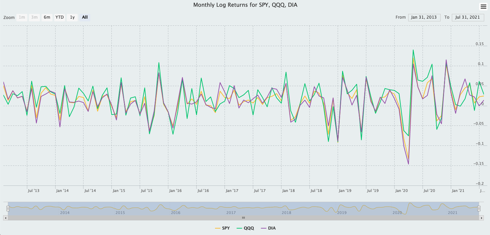
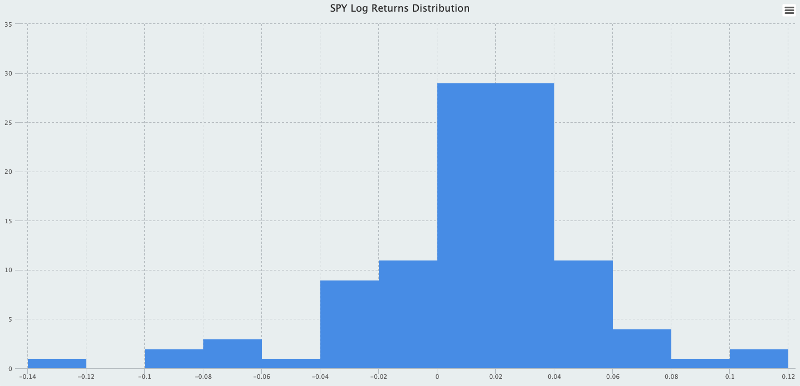
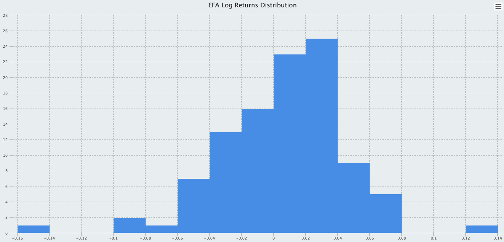
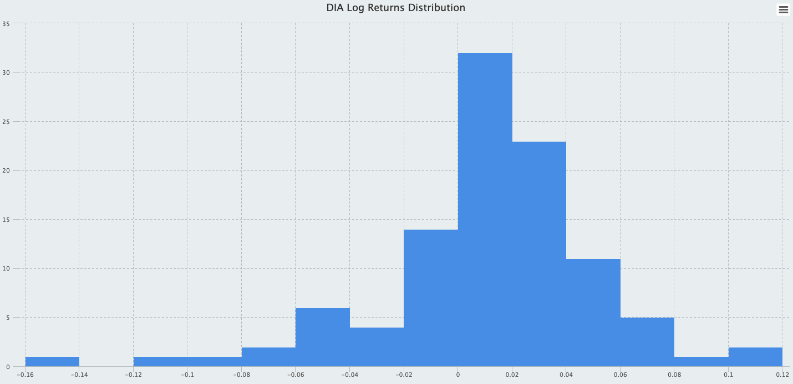
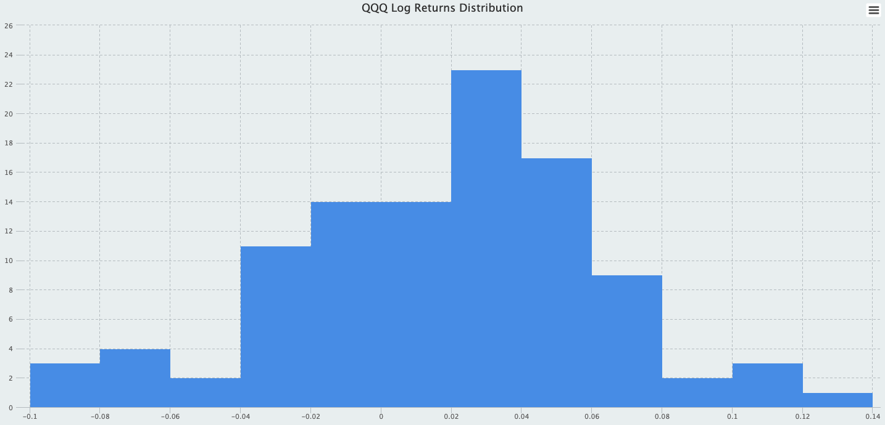
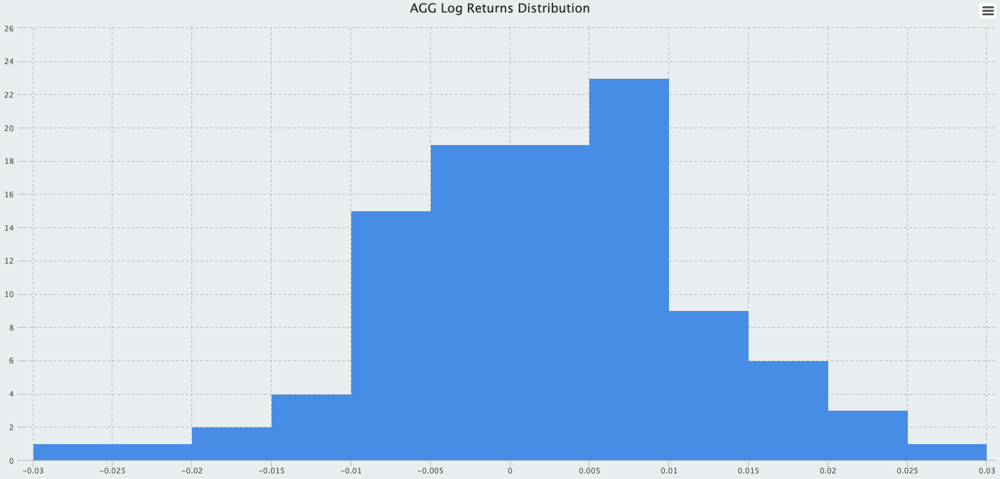

```{r setup, include=FALSE}
knitr::opts_chunk$set(echo = TRUE)
knitr::opts_chunk$set(warning = FALSE)
knitr::opts_chunk$set(comment = NA)
knitr::opts_chunk$set(message = FALSE)
knitr::opts_chunk$set(fig.width = 6, fig.height = 4, fig.align = "center")
library(tidyverse)
library(quantmod)
library(PerformanceAnalytics)
library(timetk)
library(tibbletime)
library(webshot)
library(xts)
library(zoo)
library(tidyquant)
library(highcharter)
library(widgetframe)
options(digits = 7)
```

## Visualization Asset returns in xts

&nbsp;&nbsp;&nbsp;&nbsp;&nbsp;&nbsp; In this post, we will explore some visualizations of asset returns. Similar to the previous [post](https://www.kenwuyang.com/en/post/portfolio-optimization-and-returns/), we import our data from Yahoo Finance. The five assets under examination are Exchange Traded Funds, which are funds that can be traded on an exchange like a stock. Exchange-traded funds are a type of investment fund that offers the best attributes of two popular assets: they have the diversification benefits of mutual funds and the ease with which stocks are traded. We will take a sample of daily prices from 2012-12-31 to 2021-7-31, converting them to monthly returns. This leaves us with a sample of 103 monthly returns. If you are interested in exploring a different sample, you could expand or shorten the time horizon upon importing the data. The visualization methods in this post are agnostic to the underlying data; the interpretation of these plots, however, will be different. 

```{r}
# Create a vector of ticker symbols
symbols <- c("SPY", "EFA", "DIA", "QQQ", "AGG")
# Load data from 2012 to today
prices <- quantmod::getSymbols(
  Symbols = symbols,
  src = "yahoo",
  from = "2012-12-31",
  to = "2021-7-31",
  auto.assign = TRUE,
  warnings = FALSE
) %>%
  # The map function takes an anonymous function and will return a list of five
  # The Ad() function extracts the adjusted price series for each ETF
  purrr::map(.f = ~ quantmod::Ad(get(x = .x))) %>%
  # Use reduce() to merge the elements of .x consecutively
  purrr::reduce(.f = merge) %>%
  # Use a replacement function to set column names as ticker symbols
  # This function is in prefix form
  # It is equivalent to colnames(x = prices) <- value
  `colnames<-`(value = symbols)
# Remove all objects but price series and ticker symbol vector
rm(list = setdiff(x = ls(), y = c("prices", "symbols")))
```

---

&nbsp;&nbsp;&nbsp;&nbsp;&nbsp;&nbsp; Since we will not be aggregating asset returns to compute portfolio returns, we choose log returns, i.e., the continuously compounded rate of returns, over the simple returns. Continuously compounded rate of returns should be used in statistical analysis (and visualizations) because unlike simple returns they are not positively biased. In addition, we opt to convert daily prices to monthly returns by finding the relative change of prices between the last day of each month. We could have easily chosen to use the first day of each month, and the values of the monthly returns will be different. 

```{r}
# Keep only the last price reading of each month
asset_returns_xts <- xts::to.monthly(
  x = prices,
  drop.time = TRUE,
  indexAt = "lastof",
  OHLC = FALSE
) %>%
  # Compute log returns
  PerformanceAnalytics::Return.calculate(method = "log") %>%
  # Drop the first row since we lose one observation in 12/31/2012
  stats::na.omit()
```


###  Monthly log returns highcharts

&nbsp;&nbsp;&nbsp;&nbsp;&nbsp;&nbsp; The `highcharter` [package](https://cran.r-project.org/web/packages/highcharter/highcharter.pdf) is a wrapper for the "Highcharts" Library, which has an amazing visualization infrastructure for time series and financial data. The `highcharter` package houses functions that accept xts objects (R's time series object class) as arguments, making it seamless to move from time series data to visualizations. The plot below displays the line chart for a subset of the ETF's. We could have easily plotted all five ETF's on the same line chart, but it would be harder for our eyes to compare, contrast, and identify patterns. 

```{r, eval=FALSE}
# Crate Highstock widget
highchart(type = "stock") %>%
  # Add chart main title
  hc_title(text = "Monthly Log Returns for SPY, QQQ, DIA") %>%
  # Add returns series to highchart objects
  # We use "symbols" to reference series since we may need to add/remove ETF's in the future
  # Use matrix sub-setting and character indexing to select returns by column
  hc_add_series(
    data = asset_returns_xts[, symbols[[1]]],
    name = symbols[[1]]
  ) %>%
  hc_add_series(
    data = asset_returns_xts[, symbols[[4]]],
    name = symbols[[4]]
  ) %>%
  hc_add_series(
    data = asset_returns_xts[, symbols[[3]]],
    name = symbols[[3]]
  ) %>%
  # Add theme to highchart object
  # More themes to be found in the vignette
  hc_add_theme(hc_thm = hc_theme_flat()) %>%
  # Navigator
  hc_navigator(enabled = TRUE) %>%
  # Scrollbar
  hc_scrollbar(enabled = TRUE) %>%
  # Exporting
  hc_exporting(enabled = TRUE) %>%
  # Add legend
  hc_legend(enabled = TRUE)
```

```{r, out.height="100%", out.width="100%", echo=FALSE}
# Import image

```

* The navigator is a small series below the main series, displaying a view of the entire data set. It provides tools to zoom in and out on parts of the data as well as panning across the data-set.

* The scroll-bar is a means of panning over the X axis of a stock chart. Scroll-bars can also be applied to other types of axes.

**Note:** `Highcharter` plots are highly interactive; that is, an user can hover over the line chart to interact with it. However, due to internal conflicts with `blogdown` themes, this `Highcharter` plot cannot be rendered dynamically. Please navigate to this [link](https://rpubs.com/yangwu1227/interactive_plots) to view the interactive version of this line chart.

---

### Monthly log returns Histograms

&nbsp;&nbsp;&nbsp;&nbsp;&nbsp;&nbsp; Create a function that returns a uni-variate histogram given a series of returns. The function will also take several other arguments--- an xts object of returns, a vector of ticker symbols, a symbol index, and a color for plotting. Internally, the function creates a list of histogram components: counts, density, bin breaks, etc. Then, the function `hchart()` is called on the histogram list object to plot the uni-variate histogram; this is the final output of the function. 

```{r}
hc_hist_fun <- function(xts_obj, tickers, symbol_index, color) {

  # Check for invalid input
  if (!is.xts(xts_obj) || !rlang::is_character(color) || !rlang::is_character(tickers)) {
    rlang::abort(
      message = "Invalid input type for xts_object, tickers, and/or color arguments"
    )
  }

  # Create histogram list object with 6 elements
  hc_hist <- graphics::hist(xts_obj[, tickers[[symbol_index]]],
    breaks = "Freedman-Diaconis",
    plot = FALSE
  )

  # Call hchart on the histogram list object
  hchart(object = hc_hist, color = color) %>%
    hc_title(
      text =
        paste(tickers[[symbol_index]], "Log Returns Distribution", sep = " ")
    ) %>%
    hc_add_theme(hc_thm = hc_theme_flat()) %>%
    hc_exporting(enabled = TRUE) %>%
    hc_legend(enabled = FALSE)
}
```

---

Now, we utilize the functional programming tool from `purrr` to apply the function above to each of the five uni-variate returns series.  

```{r, eval=FALSE}
# Map the histogram function to each of the returns series
list_of_histogram <- purrr::map(
  .x = 1:5,
  .f = ~ hc_hist_fun(
    xts_obj = asset_returns_xts,
    tickers = symbols,
    symbol_index = .x,
    color = "cornflowerblue"
  )
)
```

```{r, out.height="100%", out.width="100%", echo=FALSE}
# Import image

```

```{r, out.height="100%", out.width="100%", echo=FALSE}
# Import image

```

```{r, out.height="100%", out.width="100%", echo=FALSE}
# Import image

```

```{r, out.height="100%", out.width="100%", echo=FALSE}
# Import image

```

```{r, out.height="100%", out.width="100%", echo=FALSE}
# Import image

```

**Note:** Please navigate to this [link](https://rpubs.com/yangwu1227/interactive_plots) to view the interactive version of these histograms.

&nbsp;&nbsp;&nbsp;&nbsp;&nbsp;&nbsp; As can be seen, most of our assets are negatively skewed, indicating that there were a few *really bad months*. For the iShares Core US Aggregate Bond ETF (AGG), most months have returns that may be statistically indistinguishable from zero. From a sheer numbers perspective, investors who wish to maximize gains may consider such an asset undesirable. However, other performance factors such as risk, diversifier effect, and time horizon are important. The iShares Core US Aggregate Bond ETF seeks to track the investment results of an index composed of the total U.S. investment-grade bond market. And we expect bonds to produce lower returns for investors because they are also considered less volatile than stocks. 

The Invesco QQQ Trust Series 1 ETF (QQQ) stands out as a strong performing asset. Out of 103 months, about $22%$ of its monthly returns fall between $2\%$ and $4\%$. Hover over the histograms [here](https://rpubs.com/yangwu1227/interactive_plots) to see the counts and break points of the returns distribution. 

---

## Visualizations in the tidyvserse

&nbsp;&nbsp;&nbsp;&nbsp;&nbsp;&nbsp; Similarly, we could plot our asset returns using `ggplot2`, which implements the layered grammar of graphics approach. For efficiency, we will convert the xts object into the *long tidy* format that the tidyverse functions are designed to work well with. For another method of data importation that automatically converts the data into a *tidy* format, please see this [post](https://www.kenwuyang.com/en/post/portfolio-optimization-and-returns/).

```{r}
asset_returns_dplyr <- xts::to.monthly(
  x = prices,
  drop.time = TRUE,
  indexAt = "lastof",
  OHLC = FALSE
) %>%
  # Create a new "date" variable by extracting the date indices from the xts object
  base::data.frame("date" = zoo::index(x = .)) %>%
  # Coerce to tibble
  dplyr::as_tibble() %>%
  # Create a key column "asset" that contains the column names, i.e. ticker symbols
  # Create a value column that contains all the cells associated with each column
  # We convert to long format since it is easier to compute the returns using lag()
  tidyr::pivot_longer(
    cols = 1:5,
    names_to = "asset",
    values_to = "returns"
  ) %>%
  # Group by ticker symbol
  dplyr::group_by(asset) %>%
  # Compute log returns manually
  dplyr::mutate(
    "returns" = (
      log(x = returns, base = exp(1)) - log(x = dplyr::lag(x = returns), base = exp(1))
    )
  ) %>%
  # Remove NA_double_ readings for 12/31/2021
  na.omit()
# See the results
head(asset_returns_dplyr, 5)
```

---

### Histogram

&nbsp;&nbsp;&nbsp;&nbsp;&nbsp;&nbsp; Here are the histograms. Notice that we can either overlay the histograms on top of each other or show them in separate panels. I recommend using the panel approach for studying the shapes (spread, central tendency, skewness, tailed-ness, etc.) of the uni-variate distributions, and employ the overlaying histograms for making comparisons between these distributions.

```{r, fig.height= 5, fig.width=7}
# Compute Freedman-Diaconis bin numbers
bins_fd <- function(vec) {
  diff(range(vec)) / (2 * IQR(vec) / length(vec)^(1 / 3))
}
# Histogram
ggplot(data = asset_returns_dplyr, mapping = aes(x = returns)) +
  geom_histogram(
    alpha = 0.5,
    mapping = aes(fill = asset),
    bins = bins_fd(asset_returns_dplyr[["returns"]])
  ) +
  ggtitle("Distributions of Monthly Log Returns") +
  theme(
    panel.background = element_rect(fill = "grey97"),
    panel.grid = element_blank(),
  )
# Histogram with panels
ggplot(data = asset_returns_dplyr, mapping = aes(x = returns)) +
  geom_histogram(
    alpha = 0.5,
    mapping = aes(fill = asset),
    bins = bins_fd(asset_returns_dplyr[["returns"]])
  ) +
  facet_wrap(~asset) +
  ggtitle("Distributions of Monthly Log Returns") +
  theme(
    panel.background = element_rect(fill = "grey97"),
    panel.grid = element_blank(),
  )
```

---

### Densty

&nbsp;&nbsp;&nbsp;&nbsp;&nbsp;&nbsp; We could also plot the probability density functions of these historical returns. Take a look at the y-axis of these plots and compare them to those of the histograms. This is an important distinction between these otherwise similar visualizations.

```{r, fig.height= 5, fig.width=7}
# Density plot
ggplot(data = asset_returns_dplyr, mapping = aes(x = returns)) +
  geom_density(mapping = aes(color = asset)) +
  ggtitle("Distributions of Monthly Log Returns") +
  theme(
    panel.background = element_rect(fill = "grey97"),
    panel.grid = element_blank(),
  )
# Density plot with panels
ggplot(data = asset_returns_dplyr, mapping = aes(x = returns)) +
  geom_density(mapping = aes(color = asset)) +
  geom_histogram(
    alpha = 0.5,
    mapping = aes(fill = asset),
    bins = bins_fd(asset_returns_dplyr[["returns"]])
  ) +
  facet_wrap(~asset) +
  ggtitle("Distributions of Monthly Log Returns") +
  theme(
    panel.background = element_rect(fill = "grey97"),
    panel.grid = element_blank(),
  )
```

&nbsp;&nbsp;&nbsp;&nbsp;&nbsp;&nbsp; The smoothed densities can be useful for estimating the probabilities of returns, or an infinitesimal interval of returns, to be mathematically precise. Take caution when interpreting these kernel densities as it is important to understand that **the heights of the curve (the y-axis) do not represent probabilities.** The y-axis in a density plot is the probability density function for the kernel density estimation. To convert to an actual probability, we need to find the area under the curve for a specific interval of returns. It is generally difficult to estimate probabilities from densities and we will have to tackle this problem in another post. 

&nbsp;&nbsp;&nbsp;&nbsp;&nbsp;&nbsp; For now, we have equipped ourselves with some nice visualization techniques in R. These are not the only ways to visualize financial data by any means. In future posts, I will explore other aspects of financial analytics and portfolio analytics.
