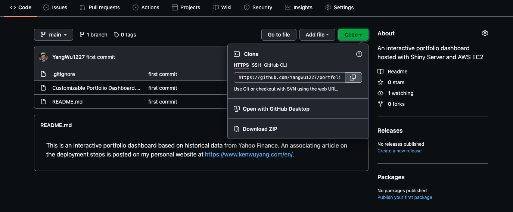
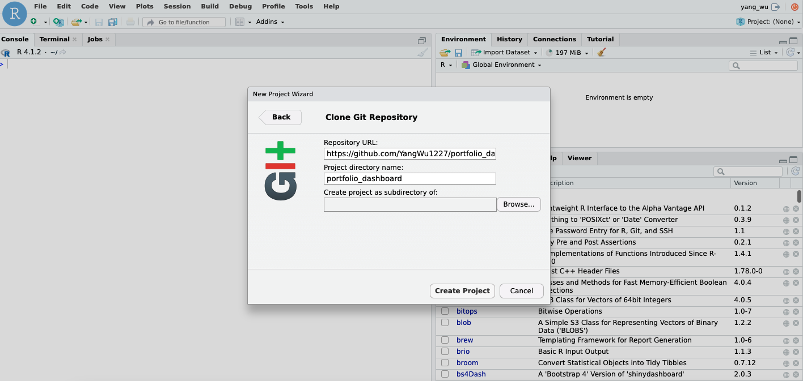

```{r setup, include=FALSE}
library(knitr)
```


&nbsp;&nbsp;&nbsp;&nbsp;&nbsp;&nbsp; Recently, I needed to deploy a `flexdashboard` that I had built. For shiny applications or interactive documents, there are a few options for deployment and hosting, including [shinyapp.io](https://www.shinyapps.io/?_ga=2.44184228.1231910523.1642619545-1368666574.1621921327), [RStudio Connect](https://www.rstudio.com/products/connect/?_ga=2.82041238.1231910523.1642619545-1368666574.1621921327), and [Shiny Server](https://www.rstudio.com/products/shiny/shiny-server/). The available resource that I had was our AWS EC2 instance, and so I decided to host our `flexdashboard` through shiny-server and AWS EC2. In short, I want to document the steps that I took and the resources that have helped me better understand the deployment process in this post for future reference. This post will be updated as my understanding of AWS, shiny, and application deployment improves over time. A **note** is that I am a MAC user, which means I'll be using the Terminal app initially for the EC2 set up.

&nbsp;&nbsp;&nbsp;&nbsp;&nbsp;&nbsp; Some resources that have helped me understand AWS and EC2 are the following:

* https://docs.aws.amazon.com/AWSEC2/latest/UserGuide/concepts.html

* https://searchaws.techtarget.com/definition/Amazon-EC2-instances

* https://youtu.be/izyqJPl9wW8

## Step 1: AWS EC2

&nbsp;&nbsp;&nbsp;&nbsp;&nbsp;&nbsp; If you are working for an organization that uses AWS EC2, the chances are that your data team or IT department may already have an EC2 instance running. In that case, consult your cloud manager or supervisor or whoever manages your organization's AWS account regarding the following:

* The root user could create your [IAM](https://docs.aws.amazon.com/AWSEC2/latest/UserGuide/security-iam.html) user account, which gives you certain access rights.

* You would need to connect to EC2 via a Secure Shell (SSH) using a Command Line Interface (CLI), and so you need to obtain the AWS EC2 `.pem` private key file.

* You may also want to obtain the SSH commands that allows you to SSH into your organization's EC2 instance. 

The rest of the setup steps may differ quite a bit depending on whether or not you are using your organization's EC2 instance or running your own. For the purpose of this post, however, we will create our own personal AWS account and EC2 instance. I find that practicing deploying an application using my own AWS account and EC2 instance has helped me ultimately set up the production environment on my organization's EC2 instance. The first step, though, is to register for an [AWS](https://aws.amazon.com/) account, which is free of charge.  

### Launch an EC2 Instance and Select an AMI

&nbsp;&nbsp;&nbsp;&nbsp;&nbsp;&nbsp; Launch an EC2 instance by selecting an [Amazon AMI](https://docs.aws.amazon.com/AWSEC2/latest/UserGuide/AMIs.html). 


Because many tutorials and resources online are based on Ubuntu, we will use the Ubuntu AMI. Not only does this option have the [free tier](https://aws.amazon.com/free/) option but, based on my experience, it could also save us a lot of pain in having to deal with system requirements later on. The Ubuntu 20.04.1 LTS (at the time of writing this post) is a well documented operating system with a large user base and so trouble shooting is relatively easier in my experience compared to an AMI such as the Amazon Linux AMI 1, which is based on Red Hat Enterprise Linux (RHEL). If you work for an organization, you may not be able to choose which AMI to use. But the steps that follow should work with other AMI (for instance, we use the Amazon Linux AMI at our organization), but note that you may run into problems installing the required system libraries and packages needed for deployment and even for R packages as some of the commands will be different.

### Choose an Instance Type

&nbsp;&nbsp;&nbsp;&nbsp;&nbsp;&nbsp; We will choose `t2.micro`, which is free tier eligible. Depending on your needs for computing resources (for instance, installing R packages with complied code), you may run out of memory with 1 GiB of Memory and 1 vCPUs, so you could also consider other instance types. I recommend reading the following [article](https://www.qa.com/about-qa/our-thinking/understanding-t2-and-t3-cpu-credits-in-aws/) to better understand the differences between instance types.


### Configure Instance Details

&nbsp;&nbsp;&nbsp;&nbsp;&nbsp;&nbsp; We could leave this as default.

#### Add Storage

&nbsp;&nbsp;&nbsp;&nbsp;&nbsp;&nbsp; The default EBS volume size is 8 GB but we get up to 30 GB of General Purpose SSD  via the free tier. See the [documentation](https://docs.aws.amazon.com/AWSEC2/latest/UserGuide/Storage.html) on EBS volume options.


### Add Tags

&nbsp;&nbsp;&nbsp;&nbsp;&nbsp;&nbsp; Tags may be useful for organizing your AWS services. See the [documentation](https://docs.aws.amazon.com/AWSEC2/latest/UserGuide/Using_Tags.html) for more on this.

### Configure Security Group

&nbsp;&nbsp;&nbsp;&nbsp;&nbsp;&nbsp; [Security groups](https://docs.aws.amazon.com/vpc/latest/userguide/VPC_SecurityGroups.html) function as virtual firewalls for your EC2 instances to control inbound and outbound traffic. By default, AWS blocks traffic from all ports except for port 22, which is the port we use to SSH into our instance. I use the following configuration based on [mgritts](http://mgritts.github.io/2016/07/08/shiny-aws/)'s article. 

| Type        | Protocol | Port Range | Source                   | Description                               |
|-------------|----------|------------|--------------------------|-------------------------------------------|
| SSH         | TCP      | 22         | Anywhere: 0.0.0.0/0, ::0 | SSH                              |
| HTTP        | TCP      | 80         | Anywhere: 0.0.0.0/0, ::0 | Use nginx to password protect and set up proxy |
| Custom TCP | TCP      | 3838       | Anywhere: 0.0.0.0/0, ::0 | Default Shiny server                     |
| Custom TCP | TCP      | 8787       | Anywhere: 0.0.0.0/0, ::0 | Default R Studio server                     |

Since our instance is utilized as a web server, we use security rules to allow IP addresses to access our instance using HTTP or Custom TCP so that external users can browse the content on our web server.

* The second rule allows for inbound [HTTP](https://www.techopedia.com/definition/15709/port-80) access from all IPv4 and IPv6 addresses.

* The third and forth allow for displaying web data based port numbers.

### Key Pair

&nbsp;&nbsp;&nbsp;&nbsp;&nbsp;&nbsp; The last step for setting up an EC2 instance is creating your `.pem` private key [file](https://docs.aws.amazon.com/AWSEC2/latest/UserGuide/ec2-key-pairs.html), or select to use an existing key file provided by your organization. 


Finally, launch your instance.

### Elastic IP

&nbsp;&nbsp;&nbsp;&nbsp;&nbsp;&nbsp; An [elastic IP address](https://docs.aws.amazon.com/AWSEC2/latest/UserGuide/elastic-ip-addresses-eip.html) is different than our EC2 instance's Public IPv4 address; in short, an Elastic IP address is allocated to our AWS account, and is ours until we release it. Therefore, this IP address can be reused for our EC2 instances. The re-usability of our IP may be useful when we want to upgrade or downgrade our EC2 instance type. Without an elastic IP address, a new Public IPv4 address will be used each time we stop and re-launch our instance. This means that any service that depends on our public IP will need to be updated. The benefit of an elastic IP address is that we can simply associate it to the new server. In other words, the elastic IP address allows us to mask the failure of an instance or software by rapidly remapping the address to a new instance in our account. The setup is as follows:


Select the `Action` drop down menu in the top right corner and choose `Associate Elastic IP address`. From now on, every time we make changes to our EC2 instance, we can simply re-associate this IP address to our new instance. 

## Step 2: Connecting to AWS EC2

### Connecting via SSH

&nbsp;&nbsp;&nbsp;&nbsp;&nbsp;&nbsp; To connect to our EC2 instance via SSH, we will use the terminal (for windows, the steps for `PuTTY` can be found [here](https://business-science.github.io/shiny-production-with-aws-book/connecting-to-ec2-with-ssh-secure-shell.html)). When you select "Connect" in your AWS console, you should be taken to the following page:


* Open the terminal, navigate to the location of our `.pem` key:

```{r, eval=FALSE}
# Change working directory 
$ cd path_to_pem_file
```

* Next, run the following command to ensure that our key is not publicly viewable:

```{r, eval=FALSE}
$ chmod 400 file.pem
```

* Connect to the instance:

```{r, eval=FALSE}
$ ssh -i "file.pem" ubuntu@ec2-public-ip-address.compute-1.amazonaws.com
```

If this is your first time connecting to your EC2 instance, you may receive an `Are you sure you want to continue connecting (yes/no/[fingerprint])?` prompt. Entering `yes` should successfully connect you to you EC2 instance: 

```{r, eval=FALSE}
Welcome to Ubuntu 20.04.3 LTS (GNU/Linux 5.11.0-1022-aws x86_64)

 * Documentation:  https://help.ubuntu.com
 * Management:     https://landscape.canonical.com
 * Support:        https://ubuntu.com/advantage

  System information as of Sat Jan 29 01:27:58 UTC 2022

  System load:  0.0               Processes:             100
  Usage of /:   4.9% of 29.02GB   Users logged in:       0
  Memory usage: 21%               IPv4 address for eth0: 172.31.91.243
  Swap usage:   0%


1 update can be applied immediately.
To see these additional updates run: apt list --upgradable
```

### Disconnecting

&nbsp;&nbsp;&nbsp;&nbsp;&nbsp;&nbsp; To disconnect from our instance:

```{r, eval=FALSE}
$ exit
```

### Upgrading and Installing System Packages 

&nbsp;&nbsp;&nbsp;&nbsp;&nbsp;&nbsp; This particular step and many of the steps that follow are places where the operating system will begin to matter. The following commands are meant to work with the Ubuntu OS (a Debian-based Linux distribution). For instance, the [Advanced package tool](https://www.vultr.com/docs/using-apt-utilities-on-ubuntu/), or APT, used to handle the installation and removal of software is developed for Ubuntu/Debian system software packages. For Red Hat-based Linux systems, the [Yellowdog Updater, Modified](https://www.redhat.com/sysadmin/how-manage-packages), or YUM, package-management utility is used. In addition, R packages can depend on software external to the R ecosystem. On Ubuntu, for instance, in order to install the `curl` R package, we must install the system library first via `apt-get install libcurl`. Resolving system dependency issues can be painful at times, and the pain points may vary based on the operating system (AMI). One effective way for troubleshooting based on my own experience is simply Google searching for system dependencies on an ad-hoc basis (after an error is thrown, for instance, when your try to install an R package). If your are lucky, you won’t be the first to crash because of a missing system library.     

```{r, eval=FALSE}
# Update commands
$ sudo apt update
$ sudo apt-get update -y
$ sudo apt-get dist-upgrade -y
# Install some system libraries
$ sudo apt-get -y install \
    nginx \
    gdebi-core \
    apache2-utils \
    pandoc \
    pandoc-citeproc \
    libssl-dev \
    libcurl4-gnutls-dev \
    libcairo2-dev \
    libgsl0-dev \
    libgdal-dev \
    libgeos-dev \
    libproj-dev \
    libxml2-dev \
    libxt-dev \
    libv8-dev \
    libhdf5-dev \
    git
```

&nbsp;&nbsp;&nbsp;&nbsp;&nbsp;&nbsp; The difference between `apt-get` and `apt` is that the former is an older command with more options while `apt` is a newer, more user-friendly command with fewer options. To understand these shell commands, I found [explainshell.com](https://explainshell.com/) (its github repo can be found [here](https://github.com/idank/explainshell])) to be extremely useful. Other resources that are also helpful include:

* [FreeBSD Manual Pages](https://www.freebsd.org/cgi/man.cgi?query=ssh)

* [Chapter 7](https://business-science.github.io/shiny-production-with-aws-book/linux-command-line-interface-cli.html) of Matt Dancho's book

To be able to compile R packages, we also need to install the [build-essentials](https://linuxhint.com/install-build-essential-ubuntu/) packages that are necessary for compiling software:

```{r, eval=FALSE}
$ sudo apt install build-essential
```

On Ubuntu, you may run the following command to check on disk space:

```{r, eval=FALSE}
$ df -h
```

If `nginx` is installed successfully, you should see the following page by entering your [Public IPv4 address](https://docs.aws.amazon.com/AWSEC2/latest/UserGuide/using-instance-addressing.html) (obtained from `Instance summary` in your AWS console) into your web browser:


## Step 3: Installing R, Rstudio Server, and Shiny Server

### Installing R from CRAN

&nbsp;&nbsp;&nbsp;&nbsp;&nbsp;&nbsp; Because R updates frequently, the latest stable version isn’t always available from Ubuntu’s default repositories, and so we’ll need to add the external repository maintained by CRAN. To install the latest version of R from [CRAN](https://cran.r-project.org/), the commands are as follows:

```{r, eval=FALSE}
# Update indices
$ sudo apt update -qq
# Install two helper packages 
$ sudo apt install --no-install-recommends software-properties-common dirmngr
# Add the signing key (by Michael Rutter) for these repositories
# To verify key, run gpg --show-keys /etc/apt/trusted.gpg.d/cran_ubuntu_key.asc 
# Fingerprint: 298A3A825C0D65DFD57CBB651716619E084DAB9
wget -qO- https://cloud.r-project.org/bin/linux/ubuntu/marutter_pubkey.asc | sudo tee -a /etc/apt/trusted.gpg.d/cran_ubuntu_key.asc
# Add the R 4.0 repo from CRAN -- adjust 'focal' to 'groovy' or 'bionic' as needed
sudo add-apt-repository "deb https://cloud.r-project.org/bin/linux/ubuntu $(lsb_release -cs)-cran40/"
```

The instructions for installing R on other operating systems can be found [here](https://cran.r-project.org/) under "Download and Install R". Finally, run the following command to install R:

```{r, eval=FALSE}
# Install recommended packages
$ sudo apt install r-base
```

Or, install without considering recommended packages:

```{r, eval=FALSE}
# Install without recommended packages
$ sudo apt install --no-install-recommends r-base
```

To check the R version:

```{r, eval=FALSE}
$ R --version
```

Other useful commands are:

```{r, eval=FALSE}
# Run R from the terminal
$ R 
# Quit
$ q()
```

&nbsp;&nbsp;&nbsp;&nbsp;&nbsp;&nbsp; If you are using an operating system that comes with another AMI, the stable version of R its the default repository may be different. For Amazon Linux AMI, the latest version of R is 3.x; depending on the R packages you need to install, this may or may not be troublesome.

### Installing Rstudio Server

&nbsp;&nbsp;&nbsp;&nbsp;&nbsp;&nbsp; To download the latest version of Rstudio server, use the following [link](https://www.rstudio.com/products/rstudio/download-server/) and select your linux platform. The official instructions are easy to follow, use the following commands to install Rstudio server for Ubuntu 20 (at the time of writing this post):

```{r, eval=FALSE}
$ sudo apt-get install gdebi-core
$ wget https://download2.rstudio.org/server/bionic/amd64/rstudio-server-2021.09.2-382-amd64.deb
$ sudo gdebi rstudio-server-2021.09.2-382-amd64.deb
```

### Installing Shiny Server

&nbsp;&nbsp;&nbsp;&nbsp;&nbsp;&nbsp; Similarly, install the `Shiny` R package and the latest version of Shiny Server by following the instructions on this [page](https://www.rstudio.com/products/shiny/download-server/).

```{r, eval=FALSE}
# Install shiny
# This may take a while to compile on tc2.micro
$ sudo su - \
-c "R -e \"install.packages('shiny', repos='https://cran.rstudio.com/')\""
# Install shiny server
$ sudo apt-get install gdebi-core
$ wget https://download3.rstudio.org/ubuntu-14.04/x86_64/shiny-server-1.5.17.973-amd64.deb
$ sudo gdebi shiny-server-1.5.17.973-amd64.deb
```

### Checking installed 

On Ubuntu, run the following commands:

```{r, eval=FALSE}
$ cd ~
$ ls
```

You should see that both Rstudio server and Shiny server are installed. On RedHat-based Linux distributions, you might use the following commands to check if both servers are properly installed:

```{r, eval=FALSE}
# List installed packages
$ sudo yum list installed
# Use grep command to filter for specific package
$ sudo yum list installed | grep nginx
```

Other resources that I have found useful are as follows:

* Bash cheat sheet by [Julien Le Coupanec](https://gist.github.com/LeCoupa/122b12050f5fb267e75f)

* Linux and Ubuntu Terminal [cheat sheet](https://garywoodfine.com/linux-terminal-command-cheat-sheets/)

* YUM commands [cheat sheet](https://access.redhat.com/sites/default/files/attachments/rh_yum_cheatsheet_1214_jcs_print-1.pdf)

If you enter `http://<public-ipv4>:8787` and `http://<public-ipv4>:3838` into your browser, you should see the following pages:


And


### Install R packages (System Library)

&nbsp;&nbsp;&nbsp;&nbsp;&nbsp;&nbsp; One way to install R packages is to install them in a [system-level or global library](https://r-pkgs.org/package-structure-state.html#library); this library is available for all users and roles of your EC2 instance. The syntax for installing R packages from CRAN within the terminal is as follows: 

```{r, eval=FALSE}
$ sudo su - -c "R -e \"install.packages(c('tidyverse', 'data.table'), repos='http://cran.rstudio.com/')\""
```

To install developmental versions of R packages from github:

```{r, eval=FALSE}
$ sudo su - -c "R -e \"install.packages('devtools', repos='http://cran.rstudio.com/')\""
$ sudo su - -c "R -e \"devtools::install_github('tidyverse/ggplot2')\""
```

**Note**: As mentioned earlier, with the `t2.micro` instance type, you may simply run out of memory installing certain R packages with compiled code (for example, `Rcpp` and `RcppArmadillo`). If this happens, it would appear that the installation process has been stuck in a never-ending process.

### Install R packages (User Library)

&nbsp;&nbsp;&nbsp;&nbsp;&nbsp;&nbsp; Alternatively, there is also the option to install add-on R packages (those that do not come with base R) in a [user-level library](https://r-pkgs.org/package-structure-state.html#library), which may be appealing for many reasons. We will return to this once we set up the user credentials for Rstudio server.

## Step 4: Rstudio Server and IDE

### User Login

&nbsp;&nbsp;&nbsp;&nbsp;&nbsp;&nbsp; The RStudio Server enables you to provide a browser based interface (the RStudio IDE) to a version of R running on a remote Linux server. The RStudio IDE can be accessed by entering `http://<public-ipv4>:8787` into your browser. The log in credentials use the user information on your EC2 instance, which is stored in the `/etc/passwd` file. This [file](https://www.cyberciti.biz/faq/understanding-etcpasswd-file-format/) stores essential information about the users on the system. We can manage users on our EC2 instance using the following commands for linux:

* In Ubuntu, there are two command-line tools that you can use to create a new user account: `useradd` and `adduser`. The former, `useradd`, is a low-level utility and `adduser` is a script written in Perl that acts as a friendly interactive frontend for `useradd`:

```{r, eval=FALSE}
$ sudo adduser username
```

The command above will prompt you to enter the following information to set up the user:

```{r, eval=FALSE}
Adding user `username' ...
Adding new group `username' (1001) ...
Adding new user `username' (1001) with group `username' ...
Creating home directory `/home/username' ...
Copying files from `/etc/skel' ...
New password: 
Retype new password: 
passwd: password updated successfully
Changing the user information for username
Enter the new value, or press ENTER for the default
	Full Name []: Your Name
	Room Number []: 
	Work Phone []: 
	Home Phone []: 
	Other []: 
Is the information correct? [Y/n] y
```

&nbsp;&nbsp;&nbsp;&nbsp;&nbsp;&nbsp; This will create the new user’s home directory, and copy files from `/etc/skel` to this directory. Within the home directory, the user can write, edit, and delete files and directories. To allow this user to be able to perform administrative tasks, add this existing user to the sudo [group](https://linuxize.com/post/how-to-add-user-to-group-in-linux/) using [usermod](https://linuxize.com/post/usermod-command-in-linux/):

```{r, eval=FALSE}
$ sudo usermod -a -G sudo username
```

&nbsp;&nbsp;&nbsp;&nbsp;&nbsp;&nbsp; Always use the `-a` (append) option when adding a user to a new group. If you omit the `-a` option, the user will be removed from any groups not listed after the -G option. On success, the `usermod` command does not display any output, but warns you if the user or group doesn’t exist.

* In Ubuntu, you can use two commands to delete a user account: `userdel` and its interactive frontend `deluser`:

```{r, eval=FALSE}
$ sudo deluser username
```

To delete the user and its home directory and mail spool, use the `--remove-home` flag:

```{r, eval=FALSE}
$ sudo deluser --remove-home username
```

Note that sometimes you may need to [kill an R session](https://docs.rstudio.com/ide/server-pro/1.1.463/server-management.html) before removing the user:

```{r, eval=FALSE}
# Kill an individual session
$ sudo rstudio-server kill-session <pid>
# Force kill all running sessions
$ sudo rstudio-server kill-all
```

The session process ID can be obtained with the following base R function:

```{r, eval=FALSE}
Sys.getpid()
```

* To change password for a user:

```{r, eval=FALSE}
$ sudo passwd username
```

* To remove a password and set up a new password upon deletion:

```{r, eval=FALSE}
$ sudo passwd -d username
```

* To see list of all users, simply use the following commands:

```{r, eval=FALSE}
# List users
$ cat /etc/passwd
$ cut -d: -f1 /etc/passwd
# Search for username using the grep command
$ grep username /etc/passwd
# Or
$ grep -w '^username' /etc/passwd
```

* To see details about the file:

```{r, eval=FALSE}
$ stat /etc/passwd
```

&nbsp;&nbsp;&nbsp;&nbsp;&nbsp;&nbsp; More information can be found via the Rstudio Server [administration guide](https://docs.rstudio.com/ide/server-pro/1.1.463/index.html). Finally, logging into your Rstudio IDE should take you to the following GUI:


Some useful commands for managing rstudio-server:

```{r, eval=FALSE}
$ sudo rstudio-server stop
$ sudo rstudio-server start
$ sudo rstudio-server restart
```

### User Library

&nbsp;&nbsp;&nbsp;&nbsp;&nbsp;&nbsp; Once you have set up a user on your EC2 instance, which creates a home directory for the username, your user-level library will be set up as well, so there is nothing extra to do here. Login to your rstudio IDE and run the following function:

```{r, eval=FALSE}
.libPaths()
```

This would return the following paths on Ubuntu:

```{r, eval=FALSE}
[1] "/home/username/R/x86_64-pc-linux-gnu-library/4.1"
[2] "/usr/local/lib/R/site-library"                  
[3] "/usr/lib/R/site-library"                        
[4] "/usr/lib/R/library"  
```

On RedHat (for instance, the Amazon Linux AMI 1), the output may be something like:

```{r, eval=FALSE}
[1] "/home/username/R/x86_64-redhat-linux-gnu-library/3.4"
[2] "/usr/lib64/R/library"                                    
[3] "/usr/share/R/library"  
```

The first path is always your user library, which means that running `install.package()` using the Rstudio IDE will install the packages in that path. On Debian and Ubuntu, the `R_LIBS_USER` [environment variable](https://rstats.wtf/r-startup.html) is set in `/etc/R/Renviron`. 

```{r, eval=FALSE}
R_LIBS_USER=${R_LIBS_USER-'~/R/$platform-library/R-version'}
```

where `$platform` is something like 'x86_64-pc-linux-gnu-library' and is dependent on the version of R installed on your EC2 instance. The environment variable `R_LIBS_SITE` is set in `/etc/R/Renviron` to

```{r, eval=FALSE}
R_LIBS_SITE=${R_LIBS_SITE-'/usr/local/lib/R/site-library:/usr/lib/R/site-library:/usr/lib/R/library'}
```

We can access the environment variables via:

```{r, eval=FALSE}
$ sudo nano /etc/R/Renviron
```

&nbsp;&nbsp;&nbsp;&nbsp;&nbsp;&nbsp; The R packages part of `r-base` and `r-recommended` are installed into the directory `/usr/lib/R/library`. The other R packages available as precompiled Debian packages `r-cran-*` and `r-bioc-*` are installed into `/usr/lib/R/site-library`. More information for Debian packages of R software can be found in the following [article](https://cran.r-project.org/bin/linux/debian/#pathways-to-r-packages). For other operating systems, the location of these *start-up* files may be different. But the configuration files can be edited directly in the IDE:

```{r, eval=FALSE}
# Install usethis
install.packages("usethis")
# Open configuration files
usethis::edit_r_environ()
```

## Step 5: Shiny Server

&nbsp;&nbsp;&nbsp;&nbsp;&nbsp;&nbsp; The best resource available for Shiny server is the [administrative guide](https://docs.rstudio.com/shiny-server/), which covers the most important information from system requirements to server management to hosting models to security.   

### Configure Shiny Server

&nbsp;&nbsp;&nbsp;&nbsp;&nbsp;&nbsp; **Important**: The first thing, though, is to stop the server:

```{r, eval=FALSE}
# Ubuntu
$ sudo systemctl stop shiny-server
# Redhat
$ sudo stop shiny-server
```

Other useful commands include:

```{r, eval=FALSE}
# Ubuntu
$ sudo systemctl start shiny-server
$ sudo systemctl status shiny-server
$ sudo systemctl restart shiny-server
# Redhat
$ sudo start shiny-server
$ sudo status shiny-server
$ sudo restart shiny-server
```

&nbsp;&nbsp;&nbsp;&nbsp;&nbsp;&nbsp; To configure Shiny server, we need to modify the [default configuration file](https://docs.rstudio.com/shiny-server/#default-configuration) located at `/etc/shiny-server/shiny-server.conf` using [GNU nano](https://linuxize.com/post/how-to-use-nano-text-editor/). 

```{r, eval=FALSE}
$ sudo nano /etc/shiny-server/shiny-server.conf
```

This should open the default configuration file:


&nbsp;&nbsp;&nbsp;&nbsp;&nbsp;&nbsp; This configuration expects that your Shiny applications are located in the following path `/srv/shiny-server/`. For other hosting models, please see the following [section](https://docs.rstudio.com/shiny-server/#hosting-model) of the administrative guide. There is one sample application in the path `/srv/shiny-server/sample-apps/hello/`. By default, Shiny Server listens (receives information) on port 3838, so the example application will be available at `http://<server-address>:3838/sample-apps/hello/`. I added the following directives to the configuration file (the list of all the directives that are supported in Shiny Server config files can be found [here](https://docs.rstudio.com/shiny-server/#appendix) in section "7.2 Configuration Settings"):


* I added the `run_as` directive followed by my username. For one, the paths in which R will look for packages (`.libPaths()`) are often user-dependent. Since the packages required to run a Shiny application are installed in my user-level library, I must run the application as the correct user. For locations configured with `site_dir`, the `run_as` setting will be used to determine which user should spawn the R Shiny processes. This setting can be configured globally, or for a particular **server** or **location**.

* I added `sanitize_errors off` to report error on the client. This is optional, since you could always check the log files located in the path `/var/log/shiny-server` using the [Less](https://linuxize.com/post/less-command-in-linux/) command. 

```{r, eval=FALSE}
$ cd /var/log/shiny-server
$ sudo less [file_name].log
```

* I changed `directory_index` to `off` to disable the `directoryIndex` page when user visits the base URL--- `http://<public-ipv4>:3838`.

### Reverse Proxy

&nbsp;&nbsp;&nbsp;&nbsp;&nbsp;&nbsp; A reverse proxy is the application that sits in front of back-end applications and forwards client requests to those applications. An [analogy](https://www.charlesbordet.com/en/guide-shiny-aws/#3-set-up-a-reverse-proxy-with-nginx) that helped me understand this better is to think of the server as a house that has many doors, which are called [ports](https://www.cloudflare.com/learning/network-layer/what-is-a-computer-port/). We are limited to 65535 listening TCP ports. If we wish to obtain some information in the house (that is, the server), we must pass one of these ports to retrieve the information from the information provider (a specific process, application or a service) associated with that port. 

&nbsp;&nbsp;&nbsp;&nbsp;&nbsp;&nbsp; Shiny server is one of such information providers, and it is located at port 3838. In order to reach Shiny server, we must specify the port number in the URL we enter into the browser--- `http://<server-address>:3838`. If we do not specific the port number or if we specified the incorrect number, we will not be able to obtain data stream from Shiny server. The reserve proxy functions like a doorman at the main entrance of the house that brings us to the right information provider without having to specify which door to pass through. It directs client requests to the appropriate back-end server.

&nbsp;&nbsp;&nbsp;&nbsp;&nbsp;&nbsp; In other words, we simply need to type `http://<server-address>` or `http://<server-address>/*` (`*` means any sub-domain) into our browser to speak to the reverse proxy, which fetches the right information for us directly. **In speaking to the reverse proxy, we do not have to specify the port number since we will have already configured the proxy to know exactly which port we want to reach.** For this task, we will use `nginx` to set up the reverse proxy, which should already be installed on your EC2 instance.

&nbsp;&nbsp;&nbsp;&nbsp;&nbsp;&nbsp; To configure `nginx`, we first need to **stop** the service. 

```{r, eval=FALSE}
$ sudo service nginx stop
# Other useful commands
$ sudo service nginx start
$ sudo service nginx status
```

Next, we need to navigate to the directory where `nginx` is installed:

```{r, eval=FALSE}
$ cd /etc/nginx
$ ls
```

&nbsp;&nbsp;&nbsp;&nbsp;&nbsp;&nbsp; The results of `ls` may differ, sometimes substantially, depending on the AMI (and the operating system) that we are using. For instance, on Ubuntu, the default installation of `nginx` might create a `sites-avalable` and a `sites-enabled` directory. On RedHat/CentOS/Fedora, the default installation of `nginx` does not include such directories. For those operating systems, the default place to store the configuration files is the following directory `/etc/nginx/conf.d/*.conf`. In addition to that, in the `/etc/nginx/nginx.conf` configuration file, we must ensure that the `include /etc/nginx/conf.d/*.conf;` directive is added in the `http` block to tell `nginx` to pull in any files in the ``/etc/nginx/conf.d` directory that has the extension `.conf`. On Ubuntu, the following set up steps are needed:

* Having navigated to the `/etc/nginx` directory, we should see at least the following sub-directories (if not, we can create them):

```{r, eval=FALSE}
conf.d sites-enabled nginx.conf  sites-available
```

* Navigate to the `sites-available` directory and create a new configuration file specifically for Shiny server:

```{r, eval=FALSE}
$ cd sites-available
$ sudo nano shiny.conf
```

* Write the following block of directives in the `shiny.conf` file:

```{r, eval=FALSE}
server {
    # Listen on 80 port
    listen 80;
    # For IPv6 addresses
    listen [::]:80;
    # The reverse proxy
    location / {
        proxy_pass http://127.0.0.1:3838/;
        proxy_redirect http://127.0.0.1:3838/ $scheme://$host/;
        proxy_http_version 1.1;
        proxy_set_header Upgrade $http_upgrade;
        proxy_set_header Connection $connection_upgrade;
        proxy_read_timeout 20d;
        proxy_buffering off;
    }
}
```

&nbsp;&nbsp;&nbsp;&nbsp;&nbsp;&nbsp; When `nginx` proxies a request, it **1)** sends the request (i.e., a client trying to access our shiny application or interactive document hosted on our EC2 instance) to a specified proxied server, **2)** fetches the response, and **3)** sends it back to the client. To understand the configuration above:

* The `proxy_pass` directive passes all requests processed in location `/` to the proxied server at the specified address `http://127.0.0.1:3838/`. See more details on this [here](https://nginx.org/en/docs/http/ngx_http_proxy_module.html#proxy_pass). Note also that the “/” prefix is used for matching requests. The location block above provides the shortest prefix (length one), and only if all other location blocks fail to provide a match will this block be used. Since we do not have any other location blocks at the moment, this one will be used.

* The `proxy_redirect` directive does something like URL rewrite, replacing `http://127.0.0.1:3838/` with variables `$scheme://$host/`. You can read more details on `proxy_redirect` [here](https://nginx.org/en/docs/http/ngx_http_proxy_module.html#proxy_redirect) and on the components of a URL [here](https://www.ibm.com/docs/en/cics-ts/5.2?topic=concepts-components-url). The full list of `nginx` variables can be found [here](http://nginx.org/en/docs/varindex.html).

* The `proxy_http_version` directive sets the HTTP protocol version for proxying. By default, version 1.0 is used. More details [here](http://nginx.org/en/docs/http/ngx_http_proxy_module.html#proxy_http_version).

* The two `proxy_set_header field value` directives have something to do with [WebSocket proxying](http://nginx.org/en/docs/http/websocket.html). These headers have to be passed explicitly so that the proxied server can know the client’s intention to switch a protocol to [WebSocket](https://youtu.be/1BfCnjr_Vjg).

* By default, the web socket connection will be closed if the proxied server does not transmit any data within 60 seconds. This timeout can be increased with the `proxy_read_timeout` directive. Set this to 20 days. The configuration measure units can be found [here](http://nginx.org/en/docs/syntax.html).

* The final directive `proxy_buffering` turns response buffering off. Disabling response buffering is necessary for applications that need immediate access to the data stream according to the following [article](https://www.nginx.com/blog/performance-tuning-tips-tricks) on `nginx` performance.

&nbsp;&nbsp;&nbsp;&nbsp;&nbsp;&nbsp; Next, we need to create a shortcut (symbolic link) inside the `sites-enabled` directory. The reason is that `nginx` does not look at `sites-available` but only the `sites-enabled` directory in the `/etc/nginx/nginx.conf` configuration file. We create the `.conf` files inside `sites-available` and create a shortcut inside `sites-enabled` to access it. One benefit of this is that, to temporarily deactivate your access to Shiny, you only have to delete the shortcut but not the actual configuration file in `sites-available`:

```{r, eval=FALSE}
$ cd /etc/nginx/sites-enabled
# Use absolute path
$ sudo ln -s /etc/nginx/sites-available/shiny.conf /etc/nginx/sites-enabled/
# To remove a symbolic link
$ sudo rm your-site-config  
```

* Finally, we need to add the following block to the configuration file located in `/etc/nginx/nginx.conf` as specified [here](http://nginx.org/en/docs/http/websocket.html). Note that you must add the following **within the http bloc** in the `nginx` configuration file:

```{r, eval=FALSE}
map $http_upgrade $connection_upgrade {
    default upgrade;
    ''      close;
} 
```

You can use the following command to open the configuration file:

```{r, eval=FALSE}
$ sudo nano /etc/nginx/nginx.conf
```

* To test if the configuration files are syntactically correct, run the following:

```{r, eval=FALSE}
$ sudo nginx -t
```

This should output the results below if the configuration test has passed:

```{r, eval=FALSE}
nginx: the configuration file /etc/nginx/nginx.conf syntax is ok
nginx: configuration file /etc/nginx/nginx.conf test is successful
```

* **Important**: By default, there will be a `default` configuration file located in the `sites-available` and `sites-enabled` directories. We must also remove them:

```{r, eval=FALSE}
$ cd /etc/nginx/sites-enabled
$ sudo rm default
$ cd /etc/nginx/sites-available
$ sudo rm default
```

* Finally, restart `nginx`:

```{r, eval=FALSE}
$ sudo service nginx start
```


## Step 6: Deployment

### Remove Example Shiny Files

&nbsp;&nbsp;&nbsp;&nbsp;&nbsp;&nbsp; To deploy your shiny application or interactive documents, we first need to remove the default `index.html` and `sample-apps` from the R Shiny server:

```{r, eval=FALSE}
# Set file permissions to read/write
$ sudo chmod 7777 /srv/shiny-server/
$ sudo rm /srv/shiny-server/index.html
$ sudo rm -rf /srv/shiny-server/sample-apps
```

For other chmod options, see [Chapter 7](https://business-science.github.io/shiny-production-with-aws-book/linux-command-line-interface-cli.html) of Matt Dancho's book.

### Github

&nbsp;&nbsp;&nbsp;&nbsp;&nbsp;&nbsp; You could upload the source files of your shiny application or interactive document directly to your EC2 instance using the `upload` button in file pane of the Rstudio IDE:


However, in this post, we will opt to host the source files in a remote repository on [github](https://github.com/), and then cloning said repository from within the Rstudio IDE on our EC2 instance. One huge benefit of this approach is [version control](https://git-scm.com/book/en/v2/Getting-Started-About-Version-Control), which allows us to easily keep track of changes to our source files over time. To set up the remote repository on github for the source files, you could read the following [chapter](https://business-science.github.io/shiny-production-with-aws-book/github.html) of Matt Dancho's book. Some resources that helped me learn more about Github and git version control in the past are:

* https://git-scm.com/book/en/v2/Getting-Started-About-Version-Control

* https://git-scm.com/book/en/v2/Getting-Started-First-Time-Git-Setup

* https://r-pkgs.org/git.html

* https://docs.github.com/en/repositories

&nbsp;&nbsp;&nbsp;&nbsp;&nbsp;&nbsp; Assuming that you now have a github repository containing all of your source files and their dependencies. The next step is to configure your git    `user.name` and `user.email` in the Rstudio terminal using the following commands:

```{r, eval=FALSE}
git config --global user.name 'Your Name'
git config --global user.email 'your_email@example.com'
git config --global credential.helper 'cache --timeout=10000000'
```

The [third command](https://git-scm.com/docs/git-credential-cache) tells git to cache your password for the next four months (about ten million seconds). For more details, please see the following [tutorial](https://github.com/jennybc/stat540_2014/blob/master/seminars/seminar92_git.md) by Jenny Bryan. Once you have configured your name and e-mail address in git, the following steps will clone the remote repository containing your source files from within the Rstudio IDE on your EC2 instance:

* In your repository, click on the `Code` (green) button and copy the HTTPS URL in the drop-down menu.



* Create a new project within your Rstudio IDE on your EC2 instance. Select `Version Control`.


* Select "Clone a project from a Git repository" and enter your URL and the name of your git repository. 



* Once you create the project, you should see that your source files are located in the file pane of the IDE:


### Deploying With Shiny Server

&nbsp;&nbsp;&nbsp;&nbsp;&nbsp;&nbsp; You are now ready to copy the source files on your EC2 to `/srv/shiny-server/`. Recall from the previous section that we are deploying through a hosting model called `site_dir`, which hosts the entire directory tree at `/srv/shiny-server`. Run the following functions to create a sub-directory within `/srv/shiny-server/` and copy your source files from your EC2 instance into said sub-directory. The name of the directory can be anything as long as it is syntactically valid:

```{r, eval=FALSE}
# To create a new sub-directory
dir.create(path = "/srv/shiny-server/portfolio_dashboard")
# Copy the source file into the directory created above
file.copy("dashboard.Rmd", "/srv/shiny-server/portfolio_dashboard")
```

If you get an error that the file you are seeking to copy does not exist, check to make sure that the first file path is specified correctly. If you created the project using the steps above, your working directory should be the project directory on your EC2 instance. Some other useful functions and commands are:

```{r, eval=FALSE}
# To remove files
file.remove("/srv/shiny-server/portfolio_dashboard/dashboard.Rmd")
# To list files in a directory
list.files(path = "/srv/shiny-server/portfolio_dashboard/")
```

In the terminal (as in our EC2 instance and not the Rstudio IDE):

```{r, eval=FALSE}
# To remove directories within /srv/shiny-server/
$ sudo rm -rf /srv/shiny-server/sub_directory
```

&nbsp;&nbsp;&nbsp;&nbsp;&nbsp;&nbsp; Now, in your browser, enter `http://http://<public-ipv4>/*` (if you created a sub-directory within `/srv/shiny-server/`) or `http://<public-ipv4>` (if you simply copied the source files to `/srv/shiny-server/`). Your application or interactive documents should be successfully deployed at you EC2's elastic IP address:


## Step 7 (Recommended): Domain Name

### Google Domain

&nbsp;&nbsp;&nbsp;&nbsp;&nbsp;&nbsp; A [domain name](https://domains.google/learn/web-terms-101/) is simply the name of a website. Examples of domain names include `google.com`, `wikipedia.org`, and `youtube.com`. If we wish to use a domain name rather than the raw IPv4/elastic IP address of our EC2 instance (for instance, you work for an organization that is security-conscious about potentially exposing its IP address), we need to purchase a domain name. If you are lucky, changes are that your organization may already own a domain. But, for this post, we will purchase our own domain name. You may be tempted to look for free solutions, but remember the century-old adage: 

> There ain't no such thing as a free lunch.

Plus, when it comes to domain names, the following statement may also be accurate:

> Customers should not buy from people simply for cheaps, but buy from those they can trust.

&nbsp;&nbsp;&nbsp;&nbsp;&nbsp;&nbsp; Fortunately, there are many trusted domain registrars where domains are available at very *reasonable* prices. You could check the Forbes [list](https://www.forbes.com/advisor/business/software/best-domain-registrar/) for the *best* domain registrars of 2021. In this post, we will use [google domain](https://domains.google/), which I have been using for my personal website, but you could also use any other registrars. The set up should be very similar for almost all domain registrars.

* The first step is to navigate to [google domain](https://domains.google/), and enter a domain into the search box:


You may wish to choose something that is not extremely well-known or popular, since those would likely have already been purchased.

* Select your domain name and proceed to checkout. Note that you need a Google account in order to purchase a domain. Signing up for a Google account is **free**. 


* Finally, you should see your purchased domain name under `My Domain` to the left of the interface. For example, here are my purchased domain names:


### DNS

> The Domain Name System, [DNS](https://dnsmadeeasy.com/support/what-is-dns), is a system that ... resolves domain names and IP addresses. It converts [humanly] readable domain names (e.g., www.google.com) into Internet Protocol (IP) addresses (e.g., 173.194.39.78). Computers can only communicate using series of numbers, so DNS was developed as a sort of “phonebook” that translates the domain you enter in your browser into a computer readable IP.

&nbsp;&nbsp;&nbsp;&nbsp;&nbsp;&nbsp; In short, the DNS is what makes it possible to navigate the web using domain names like `google.com` instead of having to remember and use the underlying IP addresses for a given website, such as 172.217.3.206. To point the purchased domain name to our application hosted on our EC2 instance, we need to create an entry of [resource record](https://support.google.com/domains/answer/3290350?authuser=2&hl=en) via the `DNS` tab to the left of the interface:


This step should be almost identical irrespective of the domain registrar. To understand the set up above:

* The `Host name` field specifies the domain, subdomain, or host. The default is `@`, which is the domain name that we have purchased. Since I want my main domain `dashwu.com` to redirect to my AWS server, I used `@`. If you wish to use a subdomain to redirect to your AWS server, you can enter something like `subdomain` in the box. Then, `dashwu.com/subdomain` will redirect to your AWS server.

* The `Type` field specifies the type of the record. We wish to point the domain to the application hosted on our EC2 instance at our elastic IP address. IP addresses are numeric addresses. When a website is created, an A (IPv4) or AAAA (IPv6) record is used to define the IP address of the website host. Therefore, we choose `A` as our record type. To learn about other record types, see the Google Domains Help [ Page](https://support.google.com/domains/answer/10751068?authuser=2).

* The `Time-To-Live (TTL)` field controls how often your local copy of the resource record is updated or discarded (the default is 1 hour).

* Lastly, the `Data` field specifies the information stored in the record. This would be different depending on the record type. In this case, it would be our AWS elastic IP address, e.g., `123.123.123.123`.

### Configure Nginx

&nbsp;&nbsp;&nbsp;&nbsp;&nbsp;&nbsp; The last step is to add the `server_name` directive to the `nginx` configuration file located at `/etc/nginx/sites-available/shiny.conf`:

```{r, eval=FALSE}
$ sudo service nginx stop
$ sudo nano /etc/nginx/sites-available/shiny.conf
```

The modified configuration file would be as follows (make sure you swap the placeholder `your_domain_name` with your own domain name):

```{r, eval=FALSE}
server {
    # Listen on 80 port
    listen 80;
    # For IPv6 addresses
    listen [::]:80;
    # Server name
    server_name your_domain_name;
    # The reverse proxy
    location / {
        proxy_pass http://127.0.0.1:3838/;
        proxy_redirect http://127.0.0.1:3838/ $scheme://$host/;
        proxy_http_version 1.1;
        proxy_set_header Upgrade $http_upgrade;
        proxy_set_header Connection $connection_upgrade;
        proxy_read_timeout 20d;
        proxy_buffering off;
    }
}
```

You could read the [documentation](http://nginx.org/en/docs/http/ngx_http_core_module.html#server_name) for details on the `server_name` directive. 

```{r, eval=FALSE}
# Restart nginx
$ sudo service nginx start
```

## Step 8 (Highly Recommended): Secure With HTTPS

&nbsp;&nbsp;&nbsp;&nbsp;&nbsp;&nbsp; If you examine your web browser when accessing your application, you may see a `flag` that looks as follows:


This is because some web browsers, such as Chrome, flag [HTTP](https://www.cloudflare.com/learning/ddos/glossary/hypertext-transfer-protocol-http/) websites as `Not Secure` in the URL bar. The flag is, in part, an effort to *encourage* web developers to switch to [Hypertext transfer protocol secure](https://www.cloudflare.com/learning/ssl/what-is-https/) (HTTPS), which is the secure version of HTTP and is also the primary protocol used to send data between a web browser and a website. While HTTP is the foundation of the internet, data stream transferring that occurs over HTTP is not encrypted, making it vulnerable to security risks such as [Man-in-the-middle attacks](https://en.wikipedia.org/wiki/Man-in-the-middle_attack). With HTTPS, traffic is encrypted such that even if the data were to be intercepted, they would appear as non-humanly readable characters.

&nbsp;&nbsp;&nbsp;&nbsp;&nbsp;&nbsp; For our purposes, this may be of concern to our clients or our bosses, so we should take care to address the problem. HTTPS uses an encryption protocol that is called [Transport Layer Security](https://www.cloudflare.com/learning/ssl/transport-layer-security-tls/) (TLS). In order to switch from HTTP to HTTPS, we first need to obtain an [TSL/SSL certificate](https://www.cloudflare.com/learning/ssl/what-is-an-ssl-certificate/), which is a data file hosted in a website's server that contains the website's public key and identity, along with other related information. We can usually obtain the certificate from a certificate authority (CA), but this approach has a cost to it. Instead, we will obtain our certificate from the [Let's Encrypt certificate authority](https://letsencrypt.org/), which offers digital certificates for free to anyone who owns a domain name.

### Let's Encrypt With Certbot

&nbsp;&nbsp;&nbsp;&nbsp;&nbsp;&nbsp; To obtain the the TSL certificate, we will use [Certbot](https://certbot.eff.org/pages/about), which is an open source software using `Let’s Encrypt` certificates on websites in order to enable HTTPS. Proceed to the following [instructions page](https://certbot.eff.org/instructions) to obtain the most *up-to-date* installation instructions for your EC2 instance. The choices for software and system should be:

* Software: Nginx

* System: Whatever AMI/OS you are running on your EC2

* Previously, Certbot can be installed from the Certbot Personal Package Archive  (PPA). The first step is to install [snapd](https://snapcraft.io/about). Conveniently, on Ubuntu 20.04.3 LTS (at the time of writing this post), Snap is pre-installed and ready to go out of the box. The following command ensures we have the latest version of `snapd`:

```{r, eval=FALSE}
$ sudo snap install core; sudo snap refresh core
```

* Install Certbot:

```{r, eval=FALSE}
$ sudo snap install --classic certbot
```

This should return something like the following:

```{r, eval=FALSE}
certbot 1.22.0 from Certbot Project (certbot-eff✓) installed
```

* Use the following to make a symbolic link between the two file paths:

```{r, eval=FALSE}
$ sudo ln -s /snap/bin/certbot /usr/bin/certbot
```

* There is a way to run Certbot so that it edits your `nginx` configuration automatically to serve it. But we just need to get a certificate, since we would like to configure `nginx` ourselves (`certonly` stands for “certificate only”):

```{r,eval=FALSE}
# Using the --nginx flag
$ sudo certbot certonly --nginx
```

For more information, you could refer to the Certbot [documentation](https://eff-certbot.readthedocs.io/en/stable/using.html). The program above will prompt you to enter an email address before confirming that you have successfully received a certificate:


* The Certbot packages on your system come with a cron job or systemd timer that will renew your certificates automatically before they expire. To test automatic renewal:

```{r, eval=FALSE}
$ sudo certbot renew --dry-run
```

This should return something like the following:

```{r, eval=FALSE}
- - - - - - - - - - - - - - - - - - - - - - - - - - - - - - - - - - - - - - - -
Processing /etc/letsencrypt/renewal/dashwu.com.conf
- - - - - - - - - - - - - - - - - - - - - - - - - - - - - - - - - - - - - - - -
Account registered.
Simulating renewal of an existing certificate for dashwu.com

- - - - - - - - - - - - - - - - - - - - - - - - - - - - - - - - - - - - - - - -
Congratulations, all simulated renewals succeeded: 
  /etc/letsencrypt/live/dashwu.com/fullchain.pem (success)
```

* The command to renew certbot is installed in one of the following locations:

```{r, eval=FALSE}
$ cd /etc/crontab/
$ cd /etc/cron.*/*
$ cd systemctl list-timers
```

* The certificate and key are save to:

```{r, eval=FALSE}
# Become root user
$ sudo -i
$ cd /etc/letsencrypt/live/dashwu.com/
```

### Configure Nginx

&nbsp;&nbsp;&nbsp;&nbsp;&nbsp;&nbsp; The default port for browser access is port 80, but HTTPS defaults to port 443. See the full list of default port numbers [here](https://docs.oracle.com/en/storage/tape-storage/sl4000/slklg/default-port-numbers.html#GUID-8B442CCE-F94D-4DFB-9F44-996DE72B2558). Stop `nginx` and open up the configuration file:

```{r, eval=FALSE}
$ sudo service nginx stop
$ sudo nano /etc/nginx/sites-available/shiny.conf
```

You configuration file should look similar to this:

```{r, eval=FALSE}
server {
    # Listen on 80 port
    listen 80;
    # For IPv6 addresses
    listen [::]:80;
    # Server name
    server_name dashwu.com;
    # The reverse proxy
    location / {
        proxy_pass http://127.0.0.1:3838/;
        proxy_redirect http://127.0.0.1:3838/ $scheme://$host/;
        proxy_http_version 1.1;
        proxy_set_header Upgrade $http_upgrade;
        proxy_set_header Connection $connection_upgrade;
        proxy_read_timeout 20d;
        proxy_buffering off;
    }
}
```

We modify the file as follows:

* Add the `http2` parameter to the listen directives (see [documentation](https://nginx.org/en/docs/http/ngx_http_v2_module.html)):

```{r, eval=FALSE}
listen 443 ssl http2;
listen [::]:443 ssl http2;
```

* Add a single catch-all HTTP block (above our HTTPS server block) to redirect all traffic to the HTTPS version of the site:

```{r, eval=FALSE}
server {
    # Sets server block as the default (catch-all) block for all unmatched domains
    listen 80;
    listen [::]:80;

    location / {
        return 301 https://$host$request_uri;
    }
}
```

The line `return 301 https://$host$request_uri` redirects all traffic to the corresponding HTTPS server block with [status code 301](https://developer.mozilla.org/en-US/docs/Web/HTTP/Status/301). The `$host` variable holds the domain name of the request.

* We also need to add a huge block that Mozilla's [SSL/TLS Configuration Generator](https://ssl-config.mozilla.org/) returns. Our configuration file should now look like this:

```{r, eval=FALSE}
server {
    listen 80;
    listen [::]:80;

    location / {
        return 301 https://$host$request_uri;
    }
}

server {
    listen 443 ssl http2;
    listen [::]:443 ssl http2;
    server_name dashwu.com;

    location / {
        proxy_pass http://127.0.0.1:3838/;
        proxy_redirect http://127.0.0.1:3838/ $scheme://$host/;
        proxy_http_version 1.1;
        proxy_set_header Upgrade $http_upgrade;
        proxy_set_header Connection $connection_upgrade;
        proxy_read_timeout 20d;
        proxy_buffering off;
    }
  
    ssl_certificate /etc/letsencrypt/live/dashwu.com/fullchain.pem;
    ssl_certificate_key /etc/letsencrypt/live/dashwu.com/privkey.pem;
    ssl_session_timeout 1d;
    ssl_session_cache shared:MozSSL:10m;  # About 40000 sessions
    ssl_session_tickets off;

    # curl https://ssl-config.mozilla.org/ffdhe2048.txt > /path/to/dhparam
    ssl_dhparam /etc/ssl/certs/dhparam.pem;

    # intermediate configuration
    ssl_protocols TLSv1.2 TLSv1.3;
    ssl_ciphers ECDHE-ECDSA-AES128-GCM-SHA256:ECDHE-RSA-AES128-GCM-SHA256:ECDHE-ECDSA-AES256-GCM-SHA384:ECDHE-RSA-AES256-GCM-SHA384:ECDHE-ECDSA-CHACHA20-POLY1305:ECDHE-RSA-CHACHA20-POLY1305:DHE-RSA-AES128-GCM-SHA256:DHE-RSA-AES256-GCM-SHA384;
    ssl_prefer_server_ciphers off;

    # HSTS (ngx_http_headers_module is required) (63072000 seconds)
    # add_header Strict-Transport-Security "max-age=63072000" always;

    # OCSP stapling
    ssl_stapling on;
    ssl_stapling_verify on;

    # verify chain of trust of OCSP response using Root CA and Intermediate certs
    ssl_trusted_certificate /etc/letsencrypt/live/dashwu.com/chain.pem;
}
```

The path placeholders that I have changed after copying the results of the generator are as follows:

* `ssl_certificate` and `ssl_certificate_key`:

```{r, eval=FALSE}
ssl_certificate /etc/letsencrypt/live/dashwu.com/fullchain.pem;
ssl_certificate_key /etc/letsencrypt/live/dashwu.com/privkey.pem;
```

* For the `ssl_dhparam` directive, use the comment to create a `dhparam.pem` file:

```{r, eval=FALSE}
$ sudo -i
$ curl https://ssl-config.mozilla.org/ffdhe2048.txt > /etc/ssl/certs/dhparam.pem
# Add to nginx configuration
ssl_dhparam /etc/ssl/certs/dhparam.pem;
```

Another way is to use [OpenSSL](https://www.openssl.org/), making sure that 2048 bits is used to create the `.pem` file:

```{r, eval=FALSE}
$ openssl dhparam -out /etc/ssl/dhparam.pem 2048
```

* The `ssl_trusted_certificate` [directive](http://nginx.org/en/docs/http/ngx_http_ssl_module.html#ssl_trusted_certificate) specifies a file with trusted CA certificates in the PEM format used to verify client certificates and OCSP responses if ssl_stapling is enabled (True for our configuration). According to the README file located in `/etc/letsencrypt/live/dashwu.com`,  the `chain.pem` file is used for OCSP stapling. Therefore, we need to add the following path to the configuration:

```{r, eval=FALSE}
ssl_trusted_certificate /etc/letsencrypt/live/dashwu.com/chain.pem;
```

* The [HTTP Strict-Transport-Security](https://developer.mozilla.org/en-US/docs/Web/HTTP/Headers/Strict-Transport-Security) response header informs browsers that the site should only be accessed using HTTPS, and that any future attempts to access it using HTTP should automatically be converted to HTTPS. Comment out the `add_header Strict-Transport-Security "max-age=63072000" always;` line since we only want to include it when we are sure everything is working.

### Add Port 443 to EC2 Security Group

&nbsp;&nbsp;&nbsp;&nbsp;&nbsp;&nbsp; The following [steps](https://docs.aws.amazon.com/AWSEC2/latest/UserGuide/working-with-security-groups.html#adding-security-group-rule) add a new rule to our EC2's security group:

* Navigate to the left pane and select "Security Group" under "Network & Security"

* Select the security group for you EC2 instance, choose Actions, Edit inbound rules

* The following inbound rules should be added:


Restart `nginx`:

```{r, eval=FALSE}
$ sudo service nginx start
```

### Include HTTP Strict-Transport-Security

&nbsp;&nbsp;&nbsp;&nbsp;&nbsp;&nbsp; Enter your elastic IP into your browser, you should see that your browser has flagged your connection as secure:


Now you may include the `HTTP Strict-Transport-Security` header in the `nginx` configuration file by *uncommenting* the line:

```{r, eval=FALSE}
$ sudo service nginx stop
$ sudo nano /etc/nginx/sites-available/shiny.conf
# Uncomment 
add_header Strict-Transport-Security "max-age=63072000" always;
# Restart
$ sudo service nginx start
```

## Step 9 (Optional): Password Protect

&nbsp;&nbsp;&nbsp;&nbsp;&nbsp;&nbsp; Sometimes we may need to password protect our application. For this task, we will use `nginx` again. In particular, the [ngx_http_auth_basic_module](http://nginx.org/en/docs/http/ngx_http_auth_basic_module.html) module allows for limiting access to resources by validating the `user name` and `password` using the “HTTP Basic Authentication” protocol.

### Configure Nginx

&nbsp;&nbsp;&nbsp;&nbsp;&nbsp;&nbsp; The following steps configure the `nginx` configuration file located at `/etc/nginx/sites-available/shiny.conf` to use the `ngx_http_auth_basic_module`. If you have not set up a domain name or switched to HTTPS, your configuration file may look different, but the steps should be very similar regardless. You essentially need to add a location block inside your server block.

* Stop `nginx` and open up the configuration file:

```{r, eval=FALSE}
$ sudo service nginx stop
$ sudo nano /etc/nginx/sites-available/shiny.conf
```

* Add the following directives to the existing location block with the shortest prefix "/":

```{r, eval=FALSE}
location / {
    proxy_pass http://127.0.0.1:3838/;
    proxy_redirect http://127.0.0.1:3838/ $scheme://$host/;
    proxy_http_version 1.1;
    proxy_set_header Upgrade $http_upgrade;
    proxy_set_header Connection $connection_upgrade;
    proxy_read_timeout 20d;
    proxy_buffering off;
    # Add the following
    auth_basic "Username and Password are required";
    auth_basic_user_file /etc/nginx/.htpasswd;
}
```

More details on `nginx` location blocks can be found [here](http://nginx.org/en/docs/beginners_guide.html) under section "Serving Static Content". For more information on `nginx` server and location block selection algorithms, see the following [article](https://www.digitalocean.com/community/tutorials/understanding-nginx-server-and-location-block-selection-algorithms). 

* Your configuration file should now look similar to this:

```{r, eval=FALSE}
server {
    listen 80;
    listen [::]:80;

    location / {
        return 301 https://$host$request_uri;
    }
}

server {
    listen 443 ssl http2;
    listen [::]:443 ssl http2;
    server_name dashwu.com;

    # The reverse proxy
    location / {
        proxy_pass http://127.0.0.1:3838/;
        proxy_redirect http://127.0.0.1:3838/ $scheme://$host/;
        proxy_http_version 1.1;
        proxy_set_header Upgrade $http_upgrade;
        proxy_set_header Connection $connection_upgrade;
        proxy_read_timeout 20d;
        proxy_buffering off;
        auth_basic "Username and Password are required";
        auth_basic_user_file /etc/nginx/.htpasswd;
    }

    ssl_certificate /etc/letsencrypt/live/dashwu.com/fullchain.pem;
    ssl_certificate_key /etc/letsencrypt/live/dashwu.com/privkey.pem;
    ssl_session_timeout 1d;
    ssl_session_cache shared:MozSSL:10m;  # About 40000 sessions
    ssl_session_tickets off;

    # curl https://ssl-config.mozilla.org/ffdhe2048.txt > /path/to/dhparam
    ssl_dhparam /etc/ssl/certs/dhparam.pem;

    # intermediate configuration
    ssl_protocols TLSv1.2 TLSv1.3;
    ssl_ciphers ECDHE-ECDSA-AES128-GCM-SHA256:ECDHE-RSA-AES128-GCM-SHA256:ECDHE-ECDSA-AES256-GCM-SHA384:ECDHE-RSA-AES256-GCM-SHA384:ECDHE-ECDSA-CHACHA20-POLY1305:ECDHE-RSA-CHACHA20-POLY1305:DHE-RSA-AES128-GCM-S>
    ssl_prefer_server_ciphers off;

    # HSTS (ngx_http_headers_module is required) (63072000 seconds)
    add_header Strict-Transport-Security "max-age=63072000" always;

    # OCSP stapling
    ssl_stapling on;
    ssl_stapling_verify on;

    # verify chain of trust of OCSP response using Root CA and Intermediate certs
    ssl_trusted_certificate /etc/letsencrypt/live/dashwu.com/chain.pem;
}
```

* If you navigate to your elastic IP address, you should now see that your application is now password protected:


### User Login

&nbsp;&nbsp;&nbsp;&nbsp;&nbsp;&nbsp; The final step is to create username-password pairs to access your application hosted on your EC2 instance at your elastic IP address. We could do so using `apache2-utils` (Debian, Ubuntu) or `httpd-tools` (RHEL/CentOS/Oracle Linux). In section "Upgrading and Installing System Packages", we have already installed `apache2-utils`. To check if it is indeed installed:

```{r, eval=FALSE}
$ dpkg --list | grep apache2-utils
# If not installed
$ sudo apt-get -y install apache2-utils
```

* To create a password file and a first user. Use the `htpasswd` utility with the `-c` flag (which stands for "create a new file"). The file `pathname` is the first argument and the `username` is the second argument:

```{r, eval=FALSE}
$ sudo htpasswd -c /etc/nginx/.htpasswd user1
```

This should prompt you to enter a password for `user1`.

* Creating additional user-password pairs does not require the `-c` flag since the file already exists:

```{r, eval=FALSE}
$ sudo htpasswd /etc/nginx/.htpasswd user2
```

* To list all files containing paired usernames and [hashed passwords](https://docs.oracle.com/cd/E26180_01/Platform.94/ATGPersProgGuide/html/s0506passwordhashing01.html):

```{r, eval=FALSE}
$ cat /etc/nginx/.htpasswd
```

* To remove a user, simply delete the file using the `-D` flag: 

```{r, eval=FALSE}
$ sudo htpasswd -D /etc/nginx/.htpasswd user2
```

* To change password for a user:

```{r, eval=FALSE}
# Change password for user2
$ sudo htpasswd /etc/nginx/.htpasswd user2
```

Refer to the [manual page](https://httpd.apache.org/docs/2.4/programs/htpasswd.html) to see other command line arguments.

## Resources

&nbsp;&nbsp;&nbsp;&nbsp;&nbsp;&nbsp; The hyperlinks embedded through out the post are the resources that have helped me improve my understanding of the deployment process, particularly through peaking *under the hood* of things. In addition, I also found the following links extremely useful.  

### Shiny

* https://github.com/reidfalconer/aws_dashboard_deployment

* https://www.charlesbordet.com/en/guide-shiny-aws/#intro

* http://mgritts.github.io/2016/07/08/shiny-aws/

* https://www.digitalocean.com/community/tutorials/how-to-set-up-shiny-server-on-ubuntu-16-04

* https://support.rstudio.com/hc/en-us/articles/213733868-Running-Shiny-Server-with-a-Proxy

### AWS

* https://docs.aws.amazon.com/

* https://business-science.github.io/shiny-production-with-aws-book/

### Nginx

* http://nginx.org/en/docs/

* https://docs.nginx.com/nginx/admin-guide/security-controls/configuring-http-basic-authentication/

### Operating Systems and IT

* https://linuxize.com/post/how-to-add-and-delete-users-on-ubuntu-20-04/

* https://www.cyberciti.biz/faq/understanding-etcpasswd-file-format/

* https://www.cyberciti.biz/faq/understanding-etcshadow-file/

* https://www.cyberciti.biz/faq/understanding-etcgroup-file/

* https://httpd.apache.org/docs/


