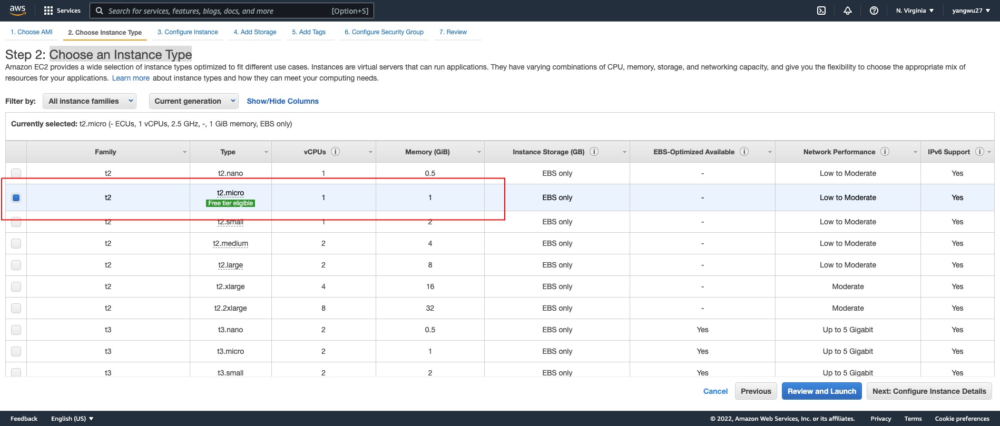
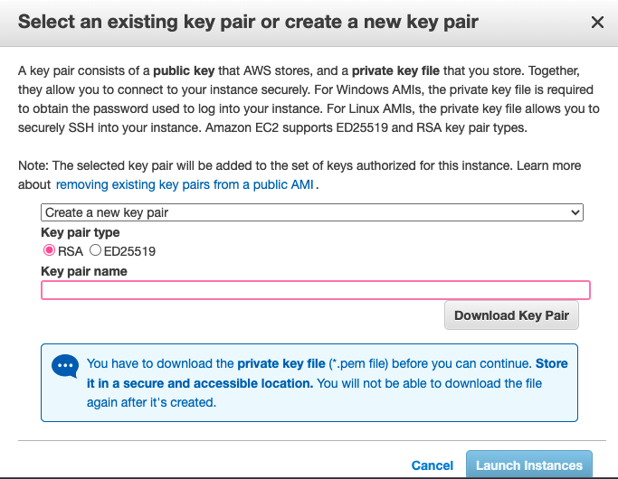
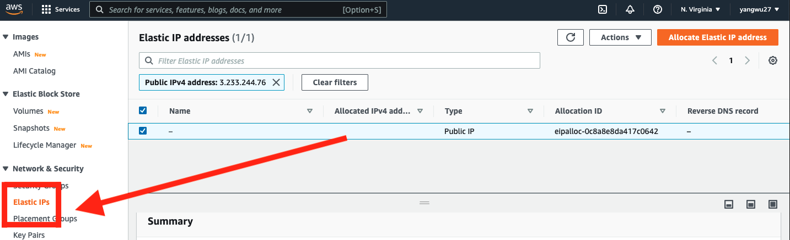

```{r setup, include=FALSE}
library(knitr)
```

&nbsp;&nbsp;&nbsp;&nbsp;&nbsp;&nbsp; In a [previous post](https://www.kenwuyang.com/en/post/deploying-shiny-apps-or-interactice-documents-with-shiny-server-and-aws/), I documented the steps for deploying shiny applications or interactive documents through shiny-server, rstudio-server, and AWS EC2. This post documents the steps for deploying apps and interactive documents using [Docker](https://www.docker.com/why-docker/), [ShinyProxy](https://www.shinyproxy.io/), and AWS EC2. **Note** again that I am a MAC user, which means I'll be using the Terminal app initially for the EC2 set up.

&nbsp;&nbsp;&nbsp;&nbsp;&nbsp;&nbsp; If you are a VS Code or Visual Studio user like myself, you could follow this [Youtube video](https://www.youtube.com/watch?v=R7cUtQu7jww&ab_channel=TrailSix) or Microsoft's official [documentation](https://code.visualstudio.com/docs/remote/ssh) to set up remote SSH, which allows you to open a remote folder on any remote machine, virtual machine, or container with a running SSH server. 

# Step 1: AWS EC2

&nbsp;&nbsp;&nbsp;&nbsp;&nbsp;&nbsp; If you are working for an organization that uses AWS EC2, the chances are that your data team or IT department may already have an EC2 instance running. In that case, consult your cloud manager or supervisor or whoever manages your organization's AWS account regarding the following:

* The root user could create your [IAM](https://docs.aws.amazon.com/AWSEC2/latest/UserGuide/security-iam.html) user account, which gives you certain access rights.

* You would need to connect to EC2 via a Secure Shell (SSH) using a Command Line Interface (CLI), and so you need to obtain the AWS EC2 `.pem` private key file.

* You may also want to obtain the SSH commands that allows you to SSH into your organization's EC2 instance. 

The rest of the setup steps may differ quite a bit depending on whether or not you are using your organization's EC2 instance or running your own. For the purpose of this post, however, we will create our own personal AWS account and EC2 instance. The first step, though, is to register for an [AWS](https://aws.amazon.com/) account, which is free of charge.  

## Launch an EC2 Instance and Select an AMI

&nbsp;&nbsp;&nbsp;&nbsp;&nbsp;&nbsp; Launch an EC2 instance by selecting an [Amazon AMI](https://docs.aws.amazon.com/AWSEC2/latest/UserGuide/AMIs.html). 


Because many tutorials and resources online are based on Ubuntu, we will use the Ubuntu AMI. The steps that follow should work with Amazon Linux 2; however, because Amazon Linux 2 is based on Red Hat Enterprise Linux (RHEL), some of the commands will be different.

## Choose an Instance Type

&nbsp;&nbsp;&nbsp;&nbsp;&nbsp;&nbsp; We will choose `t2.micro`, which is free tier eligible. Depending on your needs for computing resources (for instance, building docker images with R packages that contain complied code), you may run out of memory with 1 GiB of Memory and 1 vCPUs, so you could also consider other instance types. I recommend reading the following [article](https://www.qa.com/about-qa/our-thinking/understanding-t2-and-t3-cpu-credits-in-aws/) to better understand the differences between instance types.



## Configure Instance Details

&nbsp;&nbsp;&nbsp;&nbsp;&nbsp;&nbsp; We could leave this as default.

### Add Storage

&nbsp;&nbsp;&nbsp;&nbsp;&nbsp;&nbsp; The default EBS volume size is 8 GB but we get up to 30 GB of General Purpose SSD  via the free tier. See the [documentation](https://docs.aws.amazon.com/AWSEC2/latest/UserGuide/Storage.html) on EBS volume options.


## Add Tags

&nbsp;&nbsp;&nbsp;&nbsp;&nbsp;&nbsp; Tags may be useful for organizing our AWS services. See the [documentation](https://docs.aws.amazon.com/AWSEC2/latest/UserGuide/Using_Tags.html) for more on this.

## Configure Security Group

&nbsp;&nbsp;&nbsp;&nbsp;&nbsp;&nbsp; [Security groups](https://docs.aws.amazon.com/vpc/latest/userguide/VPC_SecurityGroups.html) function as virtual firewalls for our EC2 instances to control inbound and outbound traffic. By default, AWS blocks traffic from all ports except for port 22, which is the port we use to SSH into our instance. We need the following ports:

| Type        | Protocol | Port Range | Source                   | Description                               |
|-------------|----------|------------|--------------------------|-------------------------------------------|
| SSH         | TCP      | 22         | Anywhere: 0.0.0.0/0, ::0 | SSH                              |
| HTTP        | TCP      | 80         | Anywhere: 0.0.0.0/0, ::0 | HTTP |
| HTTPS        | TCP      | 443         | Anywhere: 0.0.0.0/0, ::0 | HTTPS |
| Custom TCP | TCP      | 3838       | Anywhere: 0.0.0.0/0, ::0 | Default Shiny server                     |
| Custom TCP | TCP      | 2375       | Anywhere: 0.0.0.0/0, ::0 | ShinyProxy Connection With Docker Daemon                     |
| Custom TCP | TCP      | 8080       | Anywhere: 0.0.0.0/0, ::0 | Default ShinyProxy                     |

Since our instance is utilized as a web server, we use security rules to allow IP addresses to access our instance using HTTP or Custom TCP so that external users can browse the content on our web server.

* The second and thrid rules allow for inbound [HTTP](https://www.techopedia.com/definition/15709/port-80) and [HTTPS](https://sectigostore.com/blog/port-443-everything-you-need-to-know-about-https-443/) access from all IPv4 and IPv6 addresses.

* The third, forth, and fifth rules allow for displaying web data based port numbers.

## Key Pair

&nbsp;&nbsp;&nbsp;&nbsp;&nbsp;&nbsp; The last step for setting up an EC2 instance is creating our `.pem` private key [file](https://docs.aws.amazon.com/AWSEC2/latest/UserGuide/ec2-key-pairs.html), or select to use an existing key file provided by your organization. 



Finally, launch our instance.

## Elastic IP

&nbsp;&nbsp;&nbsp;&nbsp;&nbsp;&nbsp; An [elastic IP address](https://docs.aws.amazon.com/AWSEC2/latest/UserGuide/elastic-ip-addresses-eip.html) is different than our EC2 instance's Public IPv4 address; in short, an Elastic IP address is allocated to our AWS account, and is ours until we release it. Therefore, this IP address can be reused for our EC2 instances. The re-usability of our IP may be useful when we want to upgrade or downgrade our EC2 instance type. Without an elastic IP address, a new Public IPv4 address will be used each time we stop and re-launch our instance. This means that any service that depends on our public IP will need to be updated. The benefit of an elastic IP address is that we can simply associate it to the new server. In other words, the elastic IP address allows us to mask the failure of an instance or software by rapidly remapping the address to a new instance in our account. The setup is as follows:



Select the `Action` drop down menu in the top right corner and choose `Associate Elastic IP address`. From now on, every time we make changes to our EC2 instance, we can simply re-associate this IP address to our new instance. **Note: if we stop our EC2 instance, our elastic IP address will no longer be associated with an EC2 instance and charges will start accruing.**

# Step 2: Connecting to AWS EC2

## Connecting via SSH

&nbsp;&nbsp;&nbsp;&nbsp;&nbsp;&nbsp; To connect to our EC2 instance via SSH, we will use the terminal (for windows, the steps for `PuTTY` can be found [here](https://business-science.github.io/shiny-production-with-aws-book/connecting-to-ec2-with-ssh-secure-shell.html)). When we select "Connect" in our AWS console, we should be taken to the following page:


* Open the terminal, navigate to the location of our `.pem` key:

```{r, eval=FALSE}
# Change working directory 
# This should be a path to the folder containing your .pem key
$ cd path_to_pem_file
```

* Next, run the following command to ensure that our key is not publicly viewable:

```{r, eval=FALSE}
$ chmod 400 file.pem
```

* Connect to the instance:

```{r, eval=FALSE}
$ ssh -i "file.pem" ubuntu@ec2-public-ip-address.compute-1.amazonaws.com
```

* If this is your first time connecting to your EC2 instance, you may receive an `Are you sure you want to continue connecting (yes/no/[fingerprint])?` prompt. Entering `yes` should successfully connect you to you EC2 instance: 

```{r, eval=FALSE}
Welcome to Ubuntu 20.04.3 LTS (GNU/Linux 5.11.0-1022-aws x86_64)

 * Documentation:  https://help.ubuntu.com
 * Management:     https://landscape.canonical.com
 * Support:        https://ubuntu.com/advantage

  System information as of Sat Jan 29 01:27:58 UTC 2022

  System load:  0.0               Processes:             100
  Usage of /:   4.9% of 29.02GB   Users logged in:       0
  Memory usage: 21%               IPv4 address for eth0: 172.31.91.243
  Swap usage:   0%


1 update can be applied immediately.
To see these additional updates run: apt list --upgradable
```

### Disconnecting

&nbsp;&nbsp;&nbsp;&nbsp;&nbsp;&nbsp; To disconnect from our instance:

```{r, eval=FALSE}
$ exit
```

In VSCode, simple `cmd + shift + P` choose `Remote: Close Remote Connection`.

## Install Docker 

#### Ubuntu

&nbsp;&nbsp;&nbsp;&nbsp;&nbsp;&nbsp; I followed the instructions in the official Docker [documentation](https://docs.docker.com/engine/install/ubuntu/).

```{r, eval=FALSE}
# Update command
$ sudo apt-get update
# Install packages to allow apt to use a repository over HTTPS:
$ sudo apt-get install \
    ca-certificates \
    curl \
    gnupg \
    lsb-release
# Add Docker’s official GPG key
$ sudo mkdir -p /etc/apt/keyrings
$ curl -fsSL https://download.docker.com/linux/ubuntu/gpg | sudo gpg --dearmor -o /etc/apt/keyrings/docker.gpg
# Set up the docker repository
$ echo \
  "deb [arch=$(dpkg --print-architecture) signed-by=/etc/apt/keyrings/docker.gpg] https://download.docker.com/linux/ubuntu \
  $(lsb_release -cs) stable" | sudo tee /etc/apt/sources.list.d/docker.list > /dev/null
# Install
$ sudo apt-get install docker-ce docker-ce-cli
# Verify installation
$ sudo docker run hello-world
```

&nbsp;&nbsp;&nbsp;&nbsp;&nbsp;&nbsp; The difference between `apt-get` and `apt` is that the former is an older command with more options while `apt` is a newer, more user-friendly command with fewer options. 

#### Amazon Linux 2 

&nbsp;&nbsp;&nbsp;&nbsp;&nbsp;&nbsp; The installation steps can be found in this [post](https://www.cyberciti.biz/faq/how-to-install-docker-on-amazon-linux-2/).

```{r, eval=FALSE}
# Update
$ sudo yum update
$ sudo yum install docker
# Check status
$ sudo systemctl status docker
```

### Docker Startup Options

&nbsp;&nbsp;&nbsp;&nbsp;&nbsp;&nbsp; According to the official documentation, ShinyProxy needs to connect to the docker daemon to spin up the containers for the Shiny apps. By default ShinyProxy will do so on port `2375` of the docker host (our EC2 instance). In order to allow for connections on port `2375`, the docker startup options need to be edited. 

#### Ubuntu

```{r, eval=FALSE}
# Update
$ mkdir /etc/systemd/system/docker.service.d
$ touch /etc/systemd/system/docker.service.d/override.conf
```

#### Amazon Linux 2

```{r, eval=FALSE}
# Update
$ sudo service docker restart
```

For both, add the variables:

```{r, eval=FALSE}
# sudo nano /etc/systemd/system/docker.service.d/override.conf
[Service]
ExecStart=
ExecStart=/usr/bin/dockerd -H unix:// -D -H tcp://127.0.0.1:2375
```

### Useful Commands (Docker)

#### Ubuntu

```{r, eval=FALSE}
$ sudo service docker status
$ sudo service docker start
$ sudo service docker stop
$ sudo service docker restart
$ sudo docker version
# List docker images
$ sudo docker image ls
# Remove docker images with '-f' force remove option
$ sudo docker image rm -f image_id
```

#### Amazon Linux 2

```{r, eval=FALSE}
$ sudo systemctl enable docker.service
$ sudo systemctl status docker.service
$ sudo systemctl start docker.service
$ sudo systemctl stop docker.service
$ sudo systemctl restart docker.service
$ sudo docker version
# List docker images
$ sudo docker image ls
# Remove docker images with '-f' force remove option
$ sudo docker image rm -f image_id
```

## Install Nginx

&nbsp;&nbsp;&nbsp;&nbsp;&nbsp;&nbsp; We need to use `nginx` to set up a [reverse proxy](https://en.wikipedia.org/wiki/Reverse_proxy#:~:text=In%20computer%20networks%2C%20a%20reverse,%2C%20performance%2C%20resilience%20and%20security.); the reason by this is explained in my previous [post](https://www.kenwuyang.com/en/post/deploying-shiny-apps-or-interactice-documents-with-shiny-server-and-aws/).

#### Ubuntu

```{r, eval=FALSE}
$ sudo apt-get install nginx
$ nginx -v
```

#### Amazon Linux 2

```{r, eval=FALSE}
$ sudo amazon-linux-extras list | grep epel
$ sudo amazon-linux-extras enable epel
$ sudo yum install epel-release
$ sudo yum install nginx
$ sudo nginx -v
```

### Nginx Configurations

&nbsp;&nbsp;&nbsp;&nbsp;&nbsp;&nbsp; The `nginx` configuration files are located in the `etc` (system configuration files) directory:

```{r, eval=FALSE}
$ cd /etc/nginx
$ ls
```

The results of `ls` may differ, sometimes substantially, depending on the AMI (and the operating system) that we are using. For instance, on Ubuntu, the default installation of `nginx` might create a `sites-avalable` and a `sites-enabled` directory. On RedHat/CentOS/Fedora, the default installation of `nginx` does not include such directories. For those operating systems, the default place to store the configuration files is the following directory `/etc/nginx/conf.d/*.conf`. In addition to that, in the `/etc/nginx/nginx.conf` configuration file, we must ensure that the `include /etc/nginx/conf.d/*.conf;` directive is added in the `http` block to tell `nginx` to pull in any files in the `/etc/nginx/conf.d` directory that has the extension `.conf`.

#### Ubuntu

* Navigate to the `/etc/nginx` directory, we should see at least the following sub-directories (if not, we can create them):

```{r, eval=FALSE}
$ cd /etc/nginx
$ ls
conf.d sites-enabled nginx.conf sites-available
```

* Navigate to the `sites-available` directory and create a new configuration file specifically for ShinyProxy. The ShinyProxy official [documentation](https://www.shinyproxy.io/documentation/security/) has an example configuration for `nginx`:

```{r, eval=FALSE}
$ cd sites-available
$ sudo nano shinyproxy.conf
```

* Write the following block of directives in the `shinyproxy.conf` file:

```{r, eval=FALSE}
server {
  listen                80;
  # Enter our domain.com or subdomain.domain.com, keeping shinyproxy as a subdomain
  server_name           shinyproxy.ourdomain.com;
  rewrite     ^(.*)     https://$server_name$1 permanent;
}

server {
  listen                443;
  # Enter our domain.com or subdomain.domain.com, keeping shinyproxy as a subdomain
  server_name           shinyproxy.ourdomain.com;
  access_log            /var/log/nginx/shinyproxy.access.log;
  error_log             /var/log/nginx/shinyproxy.error.log error;

  ssl on;
  ssl_protocols TLSv1 TLSv1.1 TLSv1.2;

  # Enter the paths to your ssl certificate and key on your EC2
  ssl_certificate       /etc/ssl/certs/ourdomain.com.crt;
  ssl_certificate_key   /etc/ssl/private/ourdomain.com.key;

   location / {
       proxy_pass          http://127.0.0.1:8080/;

       proxy_http_version 1.1;
       proxy_set_header Upgrade $http_upgrade;
       proxy_set_header Connection "upgrade";
       proxy_read_timeout 600s;

       proxy_redirect    off;
       proxy_set_header  Host              $http_host;
       proxy_set_header  X-Real-IP         $remote_addr;
       proxy_set_header  X-Forwarded-For   $proxy_add_x_forwarded_for;
       proxy_set_header  X-Forwarded-Proto $scheme;
     }

}
```

* When `nginx` proxies a request, it **1)** sends the request (i.e., a client trying to access our shiny application or interactive document hosted on our EC2 instance) to a specified proxied server, **2)** fetches the response, and **3)** sends it back to the client. To understand the configuration above:

* We would need to purchase our own domain, which is also explained in more details in the previous [post](https://www.kenwuyang.com/en/post/deploying-shiny-apps-or-interactice-documents-with-shiny-server-and-aws/). In particular, we need the following paths, substituting for `ourdomain`:

```{r, eval=FALSE}
# ssl_certificate 
$ /etc/letsencrypt/live/ourdomain.com/fullchain.pem
# ssl_certificate_key
$ /etc/letsencrypt/live/ourdomain.com/privkey.pem
```

* The `proxy_pass` directive passes all requests processed in location `/` to the proxied server at the specified address `http://127.0.0.1:8080/`. See more details on this [here](https://nginx.org/en/docs/http/ngx_http_proxy_module.html#proxy_pass). Note also that the “/” prefix is used for matching requests. The location block above provides the shortest prefix (length one), and only if all other location blocks fail to provide a match will this block be used. Since we do not have any other location blocks at the moment, this one will be used.

* The `proxy_http_version` directive sets the HTTP protocol version for proxying. By default, version 1.0 is used. More details [here](http://nginx.org/en/docs/http/ngx_http_proxy_module.html#proxy_http_version).

* The two `proxy_set_header field value` directives have something to do with [WebSocket proxying](http://nginx.org/en/docs/http/websocket.html). These headers have to be passed explicitly so that the proxied server can know the client’s intention to switch a protocol to [WebSocket](https://youtu.be/1BfCnjr_Vjg).

* By default, the web socket connection will be closed if the proxied server does not transmit any data within 60 seconds. This timeout can be increased with the `proxy_read_timeout` directive. The configuration measure units can be found [here](http://nginx.org/en/docs/syntax.html).

* Next, We need to create a shortcut (symbolic link) inside the `sites-enabled` directory. The reason is that `nginx` does not look at `sites-available` but only the `sites-enabled` directory in the `/etc/nginx/nginx.conf` configuration file. We create the `.conf` files inside `sites-available` and create a shortcut inside `sites-enabled` to access it. One benefit of this is that, to temporarily deactivate access to ShinyProxy, we only have to delete the shortcut but not the actual configuration file in `sites-available`:

```{r, eval=FALSE}
$ cd /etc/nginx/sites-enabled
# Use absolute path
$ sudo ln -s /etc/nginx/sites-available/shinyproxy.conf /etc/nginx/sites-enabled/
# To remove a symbolic link
$ sudo rm your-site-config  
```

* **Important**: By default, there will be a `default` configuration file located in the `sites-available` and `sites-enabled` directories. We must also remove them:

```{r, eval=FALSE}
$ cd /etc/nginx/sites-enabled
$ sudo rm default
$ cd /etc/nginx/sites-available
$ sudo rm default
```

* To test if the configuration files are syntactically correct, run the following:

```{r, eval=FALSE}
$ sudo nginx -t
```

* This should output the results below if the configuration test has passed:

```{r, eval=FALSE}
nginx: the configuration file /etc/nginx/nginx.conf syntax is ok
nginx: configuration file /etc/nginx/nginx.conf test is successful
```

* Finally, restart `nginx`:

```{r, eval=FALSE}
$ sudo service nginx restart
```

---

#### Amazon Linux 2

* For Amazon Linux 2, we need to place the `nginx` configuration file above in the `conf.d` directory:

```{r, eval=FALSE}
$ cd /etc/nginx/conf.d
$ sudo nano shinyproxy.conf
```

* Write the same block of directives in the `shinyproxy.conf` file:

```{r, eval=FALSE}
server {
  listen                80;
        ...
}

server {
  listen                443;
  
          ...
  
   location / {
       proxy_pass          http://127.0.0.1:8080/;
     
          ...
}
```

* Restart nginx:

```{r, eval=FALSE}
$ sudo systemctl restart nginx
```

### Useful Commands (Nginx)

#### Ubuntu

```{r, eval=FALSE}
$ sudo service nginx status
$ sudo service nginx start
$ sudo service nginx stop
$ sudo service nginx restart
```

#### Amazon Linux 2

```{r, eval=FALSE}
$ sudo systemctl status nginx
$ sudo systemctl start nginx
$ sudo systemctl stop nginx
$ sudo systemctl restart nginx
```

## Install ShinyProxy

#### Ubuntu:

* Install Java runtime environment:

```{r, eval=FALSE}
# Shinyproxy requires Java 8 (or higher)
$ sudo apt-get -y update
$ sudo apt-get -yq install \
    default-jre \
    default-jdk \
# Check version
$ java -version
```

* Obtain the latest version number for ShinyProxy [here](https://www.shinyproxy.io/downloads/):

```{r, eval=FALSE}
# Shinyproxy latest at the time of writing this post
$ export VERSION="2.6.1"
# Download and install
$ wget https://www.shinyproxy.io/downloads/shinyproxy_${VERSION}_amd64.deb
$ apt install ./shinyproxy_${VERSION}_amd64.deb
$ rm shinyproxy_${VERSION}_amd64.deb
```

#### Amazon Linux 2

* Java installation:

```{r, eval=FALSE}
$ sudo yum install java-1.8.0-openjdk
$ sudo yum install java-11-amazon-corretto
$ java -version
```

* Download most recent version shinyproxy from the official [donwload page](https://www.shinyproxy.io/downloads/) based on the platform:

```{r, eval=FALSE}
# Downloads RPM package file to current directory
$ sudo wget https://www.shinyproxy.io/downloads/shinyproxy_2.6.1_x86_64.rpm
$ sudo yum localinstall ./shinyproxy_2.6.1_x86_64.rpm
$ sudo rm ./shinyproxy_${VERSION}_amd64.deb
# Check installation
$ sudo systemctl status shinyproxy
```

### ShinyProxy Configurations

&nbsp;&nbsp;&nbsp;&nbsp;&nbsp;&nbsp; The server configuration for ShinyProxy is controlled by a file named `application.yml`. The location of this configuration file is the same for both Ubuntu and Amazon Linux 2:

```{r, eval=FALSE}
$ cd nano /etc/shinyproxy/application.yml
```

Here is an example of a configuration file:

```{r, eval=FALSE}
proxy:
  title: My Shiny Dashboards
  landing-page: /
  heartbeat-rate: 10000
  heartbeat-timeout: 60000
  port: 8080
  authentication: simple
  admin-groups: admin_user
  users:
  - name: user_1
    password: password1
    groups: admin_user
  - name: user_2
    password: password2
    groups: shiny_user
  docker:
    url: http://localhost:2375
  template-groups:
    - id: viz
      properties:
        display-name: Visualization
    - id: dash
      properties:
        display-name: Dashboard

logging:
  file:
    name: shinyproxy.log
```

&nbsp;&nbsp;&nbsp;&nbsp;&nbsp;&nbsp; ShinyProxy has a comprehensive [documentation](https://www.shinyproxy.io/documentation/configuration/) on the configuration file, including what each directive stands for. The following directives are the most important for a simple set-up:

* The `port` directive uses port `8080`, which we set up in the first step when creating our EC2 instance.

* The `authentication` directive uses the default authentication offered by ShinyProxy, which allows us to define users and groups (which user has access to which applications). This is simple to use but may not be the most secure way to set up authentication. However, ShinyProxy integrates well with other authentication technologies and platforms. For instance, follow the comprehensive guide in this [post](https://www.databentobox.com/2020/05/03/secure-shinyproxy/) to set up ShinyProxy with AWS [Cognito](https://aws.amazon.com/cognito/).

* The `docker` directive sets the `url` and port on which to connect to the docker daemon.

* The `template-groups` optionally specifies a list of groups that is used to group apps in the template. 

* Finally, every single Shiny app served by ShinyProxy has its own configuration block under `specs`, which we have not added yet. We would add these once we've containerized our shiny applications in the next step.

Save the configuration file and restart ShinyProxy:

```{r, eval=FALSE}
# Ubuntu
$ sudo service shinyproxy restart
# Amazon Linux 2
$ sudo systemctl restart shinyproxy
```

# Step 3: Containerize Shiny Application

## Dockerfile

&nbsp;&nbsp;&nbsp;&nbsp;&nbsp;&nbsp; We start with a directory `app` on our instance, perhaps as follows:

```{r, eval=FALSE}
├── app
│   ├── global.R
│   ├── server.R
│   └── ui.R
├── .gitignore
├── Dockerfile
└── README.md
```

The file of interest to us is `Dockerfile`, which allows us to build images automatically by reading the instructions it contains. A [Dockerfile](https://docs.docker.com/engine/reference/builder/#from) is a text document that contains all the commands a user could call on the command line to assemble an image. Using `docker build`, we can create an automated build that executes several command-line instructions in succession. Here is an example Dockerfile for a shiny application I've built:

```{r, eval=FALSE}
###################################################
# Build from the official base R image with R 4.2 #
###################################################

FROM r-base:4.2.0

LABEL maintainer="Yang Wu <yangwu2020@gmail.com>"

###################################
# System libraries of general use #
###################################

# The /var/lib/apt/lists stores the package information cache, which can be removed after installations
RUN apt-get update && apt-get install --no-install-recommends -y \
    libcurl4-gnutls-dev \
    libcairo2-dev \
    libssl-dev \
    libxml2-dev \
    libsodium-dev \
    && rm -rf /var/lib/apt/lists/*

#########################################
# Install dependencies of the dashboard #
#########################################

RUN install2.r --error --skipinstalled --ncpus -1 \
    readr \
    devtools \
    cranlogs \
    DBI 

##################
# Github package #
##################

RUN installGithub.r YangWu1227/tracker-dashboard

####################################
# Copy the app source to the image #
####################################

RUN mkdir /root/app
COPY app /root/app

#################################################
# Container listens on the port 3838 at runtime #
#################################################

EXPOSE 3838

# 1) '-q' means don't print startup message and 2) '-e' means execute 'EXPR' and exit
CMD ["R", "-q", "-e", "shiny::runApp('/root/app', port = 3838, host = '0.0.0.0')"]
```

The most important commands and steps are as follows:

* The `FROM` instruction initializes a new build stage and sets the Base Image for subsequent instructions. The images that are of interest to R users can be found [here](https://hub.docker.com/u/rocker). These images are built on Debian stable. 

* Our shiny applications may depend on other R packages, and so we need to install system libraries in the image. Ensuring all required system libraries are installed is sometimes an iterative process. For one, the CRAN pages for some R packages (particularly those maintained by Rstudio) list their 'SystemRequirements'. Another approach is to add the missing dependencies on a trial-and-error basis; in other words, we install the required system libraries and packages listed in the the error messages when the build process inevitably fails due to missing dependencies.

* The `install2.r` and `installGithub.r` R scripts are from the [littler](https://github.com/eddelbuettel/littler) package, which I use to install R packages in the image.

* We create a directory in the image `RUN mkdir /root/app` and copy our source code in the `app` directory (located in our EC2) to the `/root/app` directory (located in the image) using `COPY app /root/app`.

* We `EXPOSE 3838` so that the container listens on the port 3838 at runtime.

* Finally, we run the source code of our shiny application in the `/root/app` directory in the image (and not in our EC2). This command is dependent on the source code of our shiny applications. For instance, if we used [flexdashboard](https://pkgs.rstudio.com/flexdashboard/), then the command should be:

```{r, eval=FALSE}
CMD ["R", "-q", "-e", "rmarkdown::run('/root/app/source_code.Rmd', shiny_args = list(port = 3838, host = '0.0.0.0'))"]
```

### R Environment Variables

&nbsp;&nbsp;&nbsp;&nbsp;&nbsp;&nbsp; If our application requires sensitive information such as API keys or tokens (for GitHub), database credentials and secrets, or R specific environment variables, we could store them in a `.Renviron` file as name-value pairs of the form `name=value`. For example, below is an example file containing database credentials:

```{r, eval=FALSE}
# Credentials for sql database
db_name = "x"
db_password = "xxxx"
db_host = "xxxxx.redshift.amazonaws.com"
db_port = "xxxx"
db_user = "xxxx"
```

These variables can then be access in our application source code as follows:

```{r, eval=FALSE}
Sys.getenv("db_host")
Sys.getenv("db_port")
Sys.getenv("db_user")
Sys.getenv("db_password")
Sys.getenv("db_name")
```

&nbsp;&nbsp;&nbsp;&nbsp;&nbsp;&nbsp; The `.Renviron` file is run only once for each R session. Every time a user runs our application, a container spins up and serves the application, which accesses the environment variables we set. The `.Renviron` file can be placed in our `app` directory:

```{r, eval=FALSE}
├── app
│   ├── global.R
│   ├── server.R
│   └── ui.R
├── .Renviron
├── .gitignore
├── Dockerfile
└── README.md
```

We then copy the file to the root directory in the image:

```{r, eval=FALSE}
COPY .Renviron /root/.Renviron
```

## Build Image

&nbsp;&nbsp;&nbsp;&nbsp;&nbsp;&nbsp; Navigate to the `app` directory on our instance, which also contains the `Dockerfile`:

```{r, eval=FALSE}
$ sudo docker build . -t TARGET_IMAGE
```

A few notes:

* The build command above uses the current directory (`.`) as build context.

* The `-t` options allows us to tag our image with a name. For example, we can use `sudo docker build . -t tracker-dashboard`.

Once the build process completes, we can check the images using:

```{r, eval=FALSE}
$ sudo docker image ls
```

If we need to delete an image:

```{r, eval=FALSE}
$ sudo docker image rm -f image_id
```

## ShinyProxy Specs

&nbsp;&nbsp;&nbsp;&nbsp;&nbsp;&nbsp; Lastly, we add the `specs` directives into our ShinyProxy configuration file:

```{r, eval=FALSE}
proxy:
  title: My Shiny Dashboards
  landing-page: /
  heartbeat-rate: 10000
  heartbeat-timeout: 60000
  port: 8080
  authentication: simple
  admin-groups: admin_user
  users:
  - name: user_1
    password: password1
    groups: admin_user
  - name: user_2
    password: password2
    groups: shiny_user
  docker:
    url: http://localhost:2375
  template-groups:
    - id: dash
      properties:
        display-name: Dashboard
  specs:
    - id: tracker
      display-name: Tracker Dashboard
      container-cmd: ["R", "-q", "-e", "shiny::runApp('/root/app', port = 3838, host = '0.0.0.0')"]
      container-image: tracker-dashboard
      port: 3838
      access-groups: [admin_user]
      template-group: dash

logging:
  file:
    name: shinyproxy.log
```

In this configuration, we accomplished the following:

* Specify the docker image to use for the application using the `container-image` directive.

* Restrict access to this application to `admin_user` only using the `access-groups` directive. 

* List the application (`id: tracker`) under a template group called 'Dashboard' using the `template-group` directive. This directive allows use to group together applications in the ShinyProxy user interface.

Save the configuration file and restart ShinyProxy:

```{r, eval=FALSE}
# Ubuntu
$ sudo service shinyproxy restart
# Amazon Linux 2
$ sudo systemctl restart shinyproxy
```

The ShinyProxy landing page should now be accessible by entering the domain or subdomain we set up in this [step][Nginx Configurations] in the browser.

## Resources

&nbsp;&nbsp;&nbsp;&nbsp;&nbsp;&nbsp; The hyperlinks embedded through out the post are the resources that have helped me throughout deployment process. In addition, I also found the following links extremely useful.  

### ShinyProxy

* https://hosting.analythium.io/how-to-set-up-shinyproxy-to-host-shiny-apps/

* https://www.databentobox.com/2020/05/03/secure-shinyproxy/

* https://www.shinyproxy.io/documentation/

* https://github.com/openanalytics

### AWS

* https://docs.aws.amazon.com/

* https://business-science.github.io/shiny-production-with-aws-book/

### Nginx

* http://nginx.org/en/docs/

* https://ssl-config.mozilla.org/

* https://docs.nginx.com/nginx/admin-guide/security-controls/configuring-http-basic-authentication/


