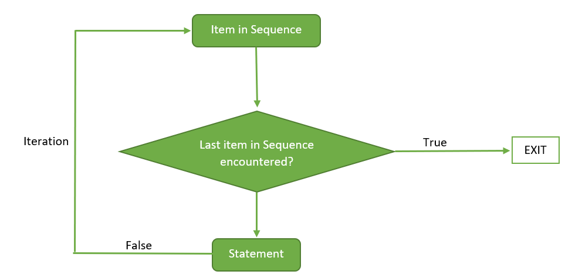
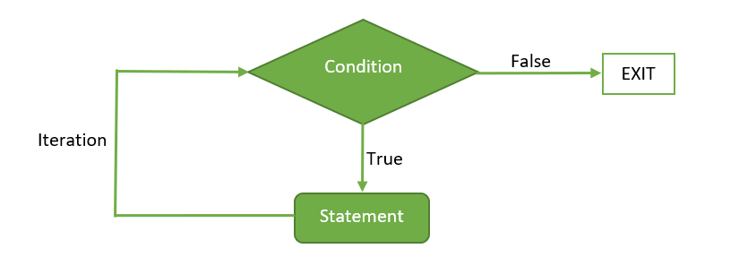
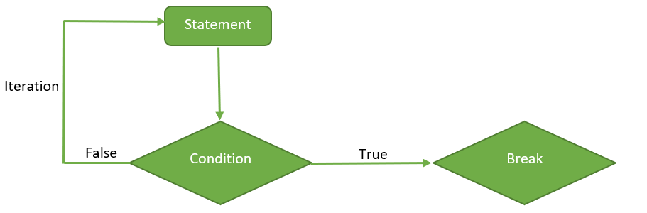

```{r setup, include=FALSE}
knitr::opts_chunk$set(echo = TRUE)
knitr::opts_chunk$set(warning = FALSE)
knitr::opts_chunk$set(collapse = TRUE)
knitr::opts_chunk$set(comment = NA)
knitr::opts_chunk$set(message = FALSE)
knitr::opts_chunk$set(fig.width = 6, fig.height = 4, fig.align = "center")
library(tidyverse)
options(digits = 7)
```

## Control Flow

&nbsp;&nbsp;&nbsp;&nbsp;&nbsp;&nbsp; Loops are an important programming concept, allowing programmers to execute blocks of code repeatedly, usually with varying options. This post will cover three types of loops--- for, while, and repeat. We will then solve some problems using loops to demonstrate the power of iteration in programming. Whenever possible, we will attempt to solve problems using different methods, including different types of loops and parallel processing. Many of R's functions are vectorized, meaning that the function will operate on all elements of a vector without needing to loop through and act on each element one at a time. We will leverage this unique feature of R to show that many problems that seem to involve loops can actually be solved differently in R, although the programs may be harder to intuit. 

&nbsp;&nbsp;&nbsp;&nbsp;&nbsp;&nbsp; For more readings on control flows in R, I suggest starting with Hadley Wickham's [Advance R](https://adv-r.hadley.nz/) and [Introduction to Scientific Programming and Simulation Using R](https://www.amazon.com/Introduction-Scientific-Programming-Simulation-Chapman/dp/1466569999).

### for loop

```{r, out.height="70%", out.width="70%", echo=FALSE}
# Import image

```

Basic syntax:

```{r, eval=FALSE}
for (item in vector) perform_action
```

For each item in vector, perform_action is called once; updating the value of item each time. There are two ways to terminate a for loop early:

* next exits the current iteration
* break exits the entire for loop

```{r}
for (i in 1:10) {
  if (i < 3) {
    next
  }

  print(i)

  if (i > 5) {
    break
  }
}
```

---

### Common pitfalls

1. Use `seq_along(x)` to generate the sequence in `for()` since it always returns a value the same length as x, even when x is a length zero vector:

```{r}
# Declare variables
means <- c()
out <- vector("list", length(means))
# For loop
for (i in seq_along(means)) {
  out[[i]] <- rnorm(10, means[[i]])
}
```

2. When iterating over S3 vectors, loops typically strip the attributes. Use [[ to work around this caveat:

```{r}
# Date
xs <- as.Date(c("2020-01-01", "2010-01-01"))
# Loop
for (i in seq_along(xs)) {
  print(xs[[i]] + 10)
}
```

---

### while loop

```{r, out.height="70%", out.width="70%", echo=FALSE}
# Import image

```

Basic syntax:

```{r, eval=FALSE}
while (condition) {
  expression_1
  ...
}
```

When a while command is executed, logical_expression is evaluated first. If it is true, then the group expressions in {} is executed. Control is then passed back to the start of the command: if logical_expression is still TRUE then the grouped expressions are executed again, and so on. For the loop to stop, logical_expression must eventually be FALSE. To achieve this, logical_expression usually depends on a variable that is altered within the grouped expressions.

---

### repeat loop

```{r, out.height="70%", out.width="70%", echo=FALSE}
# Import image

```

Basic syntax:

```{r, eval=FALSE}
repeat{
  expression_1
  ...

  if (condition) {
    break
  }
}
```

It is a simple loop that will run the same statement or a group of statements repeatedly until the stop condition has been encountered. Repeat loop does not have any condition to terminate the loop, a programmer must specifically place a condition within the loop’s body and use the declaration of a break statement to terminate this loop. If no condition is present in the body of the repeat loop then it will iterate infinitely.

---

## Forecast pension growth under compounding interest (for loop)

* Inputs

```{r}
# Annual interest rate
r <- 0.11
# Forecast duration (in years)
term <- 10
# Time between payments (in years)
period <- 1 / 12
# Amount deposited each period
payments <- 100
```

* Calculations. The function `ceiling()` takes a single numeric argument x and returns a numeric vector containing the *smallest integers not less than the corresponding elements of x*. On the other hand, `floor()` takes a single numeric argument x and returns a numeric vector containing the *largest integers not greater than the corresponding elements of x*.

```{r}
# Number of payments
n <- floor(term / period)
# Pre-allocate pension container
pension <- vector(mode = "double", length = n)
# Object size
lobstr::obj_size(pension)
# Use seq_along
seq_along(pension)
# For loop (compounded monthly)
for (i in seq_along(pension)) {
  pension[[i + 1]] <- pension[[i]] * (1 + r * period) + payments
}
# New object size
lobstr::obj_size(pension)
```

* Graph the output

```{r}
# Time
time <- (0:n) * period
# Plot
ggplot(data = tibble(time, pension), mapping = aes(x = time, y = pension)) +
  geom_point(color = "orange") +
  labs(
    title = "Forecast of Pension Value",
    x = "Time (years)", y = "Pension Value ($)"
  ) +
  theme(
    panel.background = element_rect(fill = "grey97"),
    panel.grid = element_blank()
  )
```

---

## Duration of a fixed-payment loan under monthly compounding interest (while loop)

* Inputs

```{r}
# Annual interest rate
r <- 0.11
# Time between repayments (in years)
period <- 1 / 12
# Initial principal
initial_principal <- 1000
# Fixed payment amount
payments <- 12
```

* Calculations

```{r}
# Initialize variables
time <- 0
principal <- initial_principal
# While loop
while (principal > 0) {
  # Time (in years)
  time <- time + period
  # Principal payments
  principal <- principal * (1 + r * period) - payments
}
```

* Output

```{r}
cat("Fixed-payment loan will be repaid in", time, "years\n")
```

---

## Piece-wise function (Loop and vectorization)

Consider the function $y=f(x)$ defined by 

* When $x\leq 0$, $f(x)=-x^{3}$

* When $x\in(0,1]$, $f(x)=x^{2$

* When $x>1$, $f(x)=\sqrt{x}$

---

* Implement the function using for loop:

```{r}
# Define x
x_vals <- seq.int(from = -2, to = 2, by = 0.1)
# Initialize sequence
seq <- seq_along(x_vals)
# Pre-allocate container for y values
y_vals <- vector(mode = "double", length = length(x_vals))
# For loop
for (i in seq) {

  # Set x values
  x <- x_vals[[i]]

  if (x <= 0) {
    y <- -x^3
  } else if (x > 0 & x <= 1) {
    y <- x^2
  } else if (x > 1) {
    y <- sqrt(x)
  }

  # Compute y values and store in the container vector
  y_vals[[i]] <- y
}
# Plot the function
ggplot(data = tibble(x_vals, y_vals)) +
  geom_line(mapping = aes(x = x_vals, y = y_vals), color = "blue") +
  labs(
    title = "Piecewise Function",
    x = "x", y = "y"
  ) +
  theme(
    panel.background = element_rect(fill = "grey97"),
    panel.grid = element_blank()
  )
```

* Implement the function using `case_when()` (Note that the function is $-x^3$ when $x \leq 0$; hence the negative sign in front of x)

```{r}
# Vectorization
y_vals_vectorized <- case_when(
  x_vals <= 0 ~ -x_vals^3,
  x_vals > 0 & x_vals <= 1 ~ x_vals^2,
  x_vals > 1 ~ sqrt(x_vals)
)
y_vals_vectorized
```

---

## Sequence (for loop and while loop)

* Let $h(x, n)=1+x+x^{2}+\cdots+x^{n}=\sum_{i=0}^{n} x^{i}$. Let us implement this sum of a geometric sequence using a for loop:

```{r}
# Function
sum_of_sequence_for_loop <- function(x, n) {

  # Initialize sequence
  seq <- 0:n
  # Pre-allocate container
  terms <- vector(mode = "double", length = (n + 1))
  # Loop
  for (i in seq) {
    terms[[i + 1]] <- x^i
  }

  # Sum
  sum(terms)
}
# Test
sum_of_sequence_for_loop(x = 0.3, n = 55)
sum_of_sequence_for_loop(x = 6.6, n = 8)
sum_of_sequence_for_loop(x = 1, n = 8)
```

* Using a while loop:

```{r}
# Function
sum_of_sequence_while_loop <- function(x, n) {

  # Initialize i
  i <- 0
  # Pre-allocate container
  terms <- vector(mode = "double", length = (n + 1))
  # Loop
  while (i <= n) {
    terms[[i + 1]] <- x^i
    i <- i + 1
  }

  # Sum
  sum(terms)
}
# Test
sum_of_sequence_while_loop(x = 0.3, n = 55)
sum_of_sequence_while_loop(x = 6.6, n = 8)
sum_of_sequence_while_loop(x = 1, n = 46)
```

* Implement using parallel processing--- vectorization

```{r}
# Function
sum_of_sequence_vectorized <- function(x, n) {

  # Create vector of x
  vector_of_x <- rep(x = x, times = n + 1)

  # Create vector of exponents
  vector_of_exponents <- seq.int(from = 0, to = n, by = 1)

  # Create vector of terms in the sequence
  vector_of_terms <- vector_of_x^vector_of_exponents

  # Find the sum
  sum(vector_of_terms)
}
# Test
sum_of_sequence_vectorized(x = 0.3, n = 55)
sum_of_sequence_vectorized(x = 6.6, n = 8)
sum_of_sequence_vectorized(x = 1, n = 46)
```

---

## Geometric and Harmonic Means (for loop and vectorization)

The geometric mean of a vector is defined as follows:

\begin{align*}
\left(\prod_{i=1}^{n} x_{i}\right)^{\frac{1}{n}}=\sqrt[n]{x_{1} x_{2} \cdots x_{n}}
\end{align*}

* Geometric mean (for loop)

```{r}
geometric_for_loop <- function(x) {

  # Length of vector
  n <- length(x)

  # Warning
  if (is.numeric(x) == FALSE) {
    rlang::abort("Vector is of the wrong type; input must be numeric")
  } else if (n < 2) {
    rlang::abort("Input vector must contain more than 1 element")
  }

  # Initialize first term (as.double() ensures no integer overflow)
  x_val <- as.double(x[[1]])
  # Iterate over the sequence 1:(n - 1)
  # The algorithm involves multiplying the current element i by the next (i + 1) element in x
  # Setting (n - 1) as the last item safeguards against out-of-bounds subsetting of "x"
  seq <- 1:(n - 1)
  # Iterate
  for (i in seq) {
    x_val <- x_val * x[[i + 1]]
  }


  # Geometric mean
  (x_val)^(1 / n)
}
# Test
# Create a random vector
x <- sample(x = 1:45, size = 200, replace = TRUE)
# A function from the psych package
psych::geometric.mean(x)
# Our custom function
geometric_for_loop(x)
```

* Geometric mean (vectorization)

```{r}
geometric_vectorization <- function(x) {

  # Length of vector
  n <- length(x)

  # Warning
  if (is.numeric(x) == FALSE) {
    rlang::abort("Vector is of the wrong type; input must be numeric")
  } else if (n < 2) {
    rlang::abort("Input vector must contain more than 1 element")
  }

  # Product of vector elements
  # The function prod() is primitive
  prod <- prod(x)
  # Geometric mean
  prod^(1 / n)
}
# Test
geometric_vectorization(x)
```

* Harmonic mean (for loop)

```{r}
harmonic_for_loop <- function(x) {

  # Length of vector
  n <- length(x)

  # Warning
  if (is.numeric(x) == FALSE) {
    rlang::abort("Vector is of the wrong type; input must be numeric")
  } else if (n < 2) {
    rlang::abort("Input vector must contain more than 1 element")
  }

  # Initialize x value
  x_val <- as.double(1 / x[[1]])
  # Create sequence
  seq <- 1:(n - 1)
  # Iterate
  for (i in seq) {
    x_val <- x_val + (1 / x[[i + 1]])
  }

  # Harmonic mean
  n / x_val
}
# Test
# A function from the psych package
psych::harmonic.mean(x)
# Our custom function
harmonic_for_loop(x)
```

* Harmonic mean (vectorization)

```{r}
harmonic_vectorization <- function(x) {

  # Length of vector
  n <- length(x)

  # Warning
  if (is.numeric(x) == FALSE) {
    rlang::abort("Vector is of the wrong type; input must be numeric")
  } else if (n < 2) {
    rlang::abort("Input vector must contain more than 1 element")
  }

  # Find element-wise reciprocals
  x_reciprical <- 1 / x
  # Sum the reciprocals
  sum <- sum(x_reciprical)
  # Harmonic mean
  n / sum
}
# Test
harmonic_vectorization(x)
```

---

## Find the Sum of Every nth Element of a Vector 

* Using for loop

```{r}
# Function
every_nth_element_for_loop <- function(x, n) {

  # Define the nth term
  n <- n
  # Initialize sequence
  seq <- seq_along(x)
  # Initialize counter
  counter <- 0
  # Pre-allocate container
  new_x <- vector(mode = "double", length = length(x))
  # Loop
  for (i in seq) {

    # Count the term
    counter <- counter + 1

    # If counter gets to n, copy that term to the container
    if (counter == n) {
      new_x[[i]] <- x[[i]]

      # Reinitialize counter to zero
      counter <- 0
    }
  }

  # Sum
  new_x
}
# Test vector
x <- sample(x = 1:203, size = 100, replace = TRUE)
x
# A vector that contains every thirteenth element of a vector
every_nth_element_for_loop(x = x, n = 13)
# Find sum
sum(every_nth_element_for_loop(x = x, n = 13))
```

* Using while loop

```{r}
# Function
every_nth_element_while_loop <- function(x, n) {

  # Length of vector
  length <- length(x)
  # Initial value
  value <- 0
  # Initialize counter
  counter <- n
  # Loop
  # Use modulo to ensure that, whenver the counter gets to the nth element, the logical evaluates to true
  while (counter %% n == 0) {

    # Extract the element from x using the index "counter"
    # This counter is every nth element in the vector or the logical above wouldn't have evaluated to true
    # Alter the value by add the nth term
    value <- value + x[[counter]]

    # Increase the counter by n
    # Now the logical above will again evaluate to true
    counter <- counter + n

    # Exit condition
    if (counter > length) {
      break
    }
  }

  # Sum
  value
}
# Test (This result should corroborate with that of the function above)
every_nth_element_while_loop(x = x, n = 13)
```

* Using subsetting and `seq()`

```{r}
# Function
every_nth_element_subsetting <- function(x, n) {

  # Define the nth term
  n <- n
  # Create a sequence of indices for subsetting
  seq <- seq.int(from = n, to = length(x), by = n)
  # Sum
  sum(x[seq])
}
# Test
every_nth_element_subsetting(x = x, n = 13)
```

---

## Chart the flow of a simple program

&nbsp;&nbsp;&nbsp;&nbsp;&nbsp;&nbsp; Charting the flow of the following program is a good way to see how for loops work in R. We will write out the program line by line so as to understand what it is doing *exactly*.

```{r}
x <- 3 # line 1
for (i in 1:3) { # line 2
  show(x) # line 3
  if (x[[i]] %% 2 == 0) { # line 4
    x[[i + 1]] <- x[[i]] / 2 # line 5
  } else { # line 6
    x[[i + 1]] <- 3 * x[[i]] + 1 # line 7
  } # line 8
} # line 9
show(x) # line 10
```

* line 1: Set x equal to 3, which is a double vector of length 1.
* line 2: Set i to 1.
* line 3: Show x to the screen.
* line 4: Take the first element of x and divide by 2; by default, r returns the dividend if the divisor is larger than the dividend (i.e. 2 > 1 and so 1 %% 2 is 1).
Therefore, (x[[i]] %% 2 == 0) evaluates to FALSE. Proceed to line 7.
* line 7: Carry out the sub-assignment by setting the second element of x to 10.
* line 8: End of else action.
* line 9: End of for loop and return to line 2.
* line 2: Set i to 2.
* line 3: Show x, which is now a length-2 vector $\langle3,10\rangle$.
* line 4: The expression (x[[2]] %% 2 == 0) evaluates to TRUE, since 10 divided by 2 is 5 remainder 0. Proceed to line 5.
* line 5: Sub-assign the third element in x as 5; x[[2]] is 10 and 10 divided by 2 is 5.
* line 6: End of if statement and return to line 2.
* line 2: Set i to 3.
* line 3: Show x, which is now a length-3 vector $\langle3,10,5\rangle$.
* line 4: (x[[3]] %% 2 == 0) evaluates to FALSE since x[[3]] is 5 and 5 %% 2 is 2 remainder 1. Proceed to line 7
* line 7: Sub-assign the fourth element of x to 16 since $(3\times5)+ 1=16$.
* line 8: End of else action.
* line 9: End of for loop. The sequence is exhausted. Proceed to line 10.
* line 10: Show x, which is now a length-4 vector $\langle3,10,5,16\rangle$.

---

## The Lotka-Volterra Model for a predator-prey system

&nbsp;&nbsp;&nbsp;&nbsp;&nbsp;&nbsp; We suppose that $x(t)$ is the number of prey animals at the start of a year $t$ (rabbits) and $y(t)$ is the number of predators (foxes), then the Lotka-Volterra model is:
\begin{align*}
x(t+1) &=x(t)+b_{r} \cdot x(t)-d_{r} \cdot x(t) \cdot y(t) \\
y(t+1) &=y(t)+b_{f} \cdot d_{r} \cdot x(t) \cdot y(t)-d_{f} \cdot y(t)
\end{align*}

where the parameters are defined by:

* $b_{r}$ is the natural birth rate of rabbits in the absence of predation;
* $d_{r}$ is the death rate per encounter of rabbits due to predation; 
* $d_{f}$ is the natural death rate of foxes in the absence of food (rabbits); 
* $b_{f}$ is the efficiency of turning predated rabbits into foxes.

```{r}
# Growth rate of rabbits
br <- 0.04
# Death rate of rabbits due to predation
dr <- 0.0005
# Death rate of foxes in the absence of of food
df <- 0.2
# Efficiency of turning predated rabbits into foxes
bf <- 0.1
# Initial predator/prey populations
x <- 4200
y <- 100
# Model output
while (x > 3900) { # line 1
  cat("x =", x, " y =", y, "\n") # line 2
  x.new <- (1 + br) * x - dr * x * y # line 3
  y.new <- (1 - df) * y + bf * dr * x * y # line 4
  x <- x.new # line 5
  y <- y.new # line 6
} # line 7
```


* line 1: The initial population of rabbits is $x = 4000$. Therefore $(x > 3900)$ evaluates to TRUE. Proceed to line 2.
* line 2: Concatenate and print the populations of predator and prey at state one. The "dash n" in `cat` means start a new line, ensuring that the printed output are printed lines by line successively instead of just one line.
* line 3: Compute the new population of rabbits and bind that object value to the name x.new.
* line 4: Compute the new population foxes and bind that object value to the name y.new.
* line 5: Bind x.new to x.
* line 6: Bind y.new to y.
* line 7: End of while loop. Return to line 1.
* line 1: If (x > 3900) still evaluates to TRUE, repeat as above for state two, three, and so on. If not, end of program.

---

## Find the Minimum of a Vector

```{r}
find_min_max <- function(x, summary_stat) {

  # Find minimum or maximum
  if (summary_stat == "min") {

    # Initialize minimum value
    x_min <- x[[1]]
    # Loop
    for (i in 2:length(x)) {
      if (x_min > x[[i]]) {
        x_min <- x[[i]]
      }
    }
    # Output
    x_min
  } else if (summary_stat == "max") {

    # Initialize minimum value
    x_max <- x[[1]]
    # Loop
    for (i in 2:length(x)) {
      if (x_max < x[[i]]) {
        x_max <- x[[i]]
      }
    }
    # Output
    x_max
  } else {

    # Warning
    rlang::abort(message = "summary_stat must either be min or max")
  }
}
```

The function above uses if statements and for loops; we may need to benchmark for performance.

```{r}
# Test vector
x <- sample(x = 20:1923, size = 1000, replace = FALSE)
# Find min and max
find_min_max(x, summary_stat = "min")
find_min_max(x, summary_stat = "max")
# Confirm using base R functions
min(x)
max(x)
```

&nbsp;&nbsp;&nbsp;&nbsp;&nbsp;&nbsp; That is it for control flows in R! I am looking forward to writing more python related posts also to add some different flavors of programming to the content on this website. Stay tuned!  
