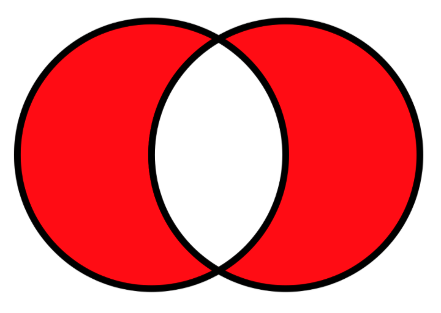

```{r setup, include=FALSE}
knitr::opts_chunk$set(echo = TRUE)
knitr::opts_chunk$set(warning = FALSE)
knitr::opts_chunk$set(collapse = TRUE)
knitr::opts_chunk$set(comment = NA)
knitr::opts_chunk$set(message = FALSE)
knitr::opts_chunk$set(fig.width = 5, fig.height = 3, fig.align = "center")
library(tidyverse)
library(rlang)
```

&nbsp;&nbsp;&nbsp;&nbsp;&nbsp;&nbsp; In this post, we will cover some useful applications of R's subsetting operations. The content of this post is taken from [Advance R](https://adv-r.hadley.nz/). This book is aimed at helping R users improve their programming skills beyond day-to-day data analysis. To better understand the content of this post, I recommend reading chapter 4 of Hadley's book beforehand. Or, if you are already familiar with R's subsetting operators, jump right in.

&nbsp;&nbsp;&nbsp;&nbsp;&nbsp;&nbsp; I wanted to document some of the content from Hadley's book with my added commentary to help my future self as well as others who may accidentally stumble across this post. I believe that many of these examples can be extended and employed in a variety of settings, and so my goal here is to turn this post into a resource not just for myself but perhaps others in their daily use of R. With that being said, let's get started.

## Matching and merging by hand (integer subsetting)

&nbsp;&nbsp;&nbsp;&nbsp;&nbsp;&nbsp; The function `match()` returns a vector that contains the position indices of the (first) matches of its first argument "x = " in its second "table = ". For instance, `match(x, table)` will return the position where each element in "x" is found in "table." This function allows us to create look-up tables. For instance, say we observe a vector of student grades in the world and a table that describe their properties. Let us say our goal is to create a data frame where each row is an observation of student grade and each column is a property associated with that letter grade. We can use a look-up table to map the properties to our vector of grades:

```{r}
# Grades
grades <- c(1, 2, 2, 3, 1)
# Info
info <- data.frame(
  grade = 3:1,
  desc = c("Excellent", "Good", "Poor"),
  fail = c(F, F, T)
)
info
# Match the grades to the "grade" column in the info table
# This is a vector indices we would later use to subset the info table
id <- match(x = grades, table = info[["grade"]])
id
# Subset the info table as a matrix
# Select rows according to the order in which they appear in the index vector
info[id, ]
```

Here, we've selected the rows in the info table, sometimes more than once, so that each row is an observation of student grade.

---

## Random samples and bootstraps (integer subsetting)

&nbsp;&nbsp;&nbsp;&nbsp;&nbsp;&nbsp; If we would like to randomly sample or bootstrap a vector or a data frame, we can use `sample()` to generate a random index vector. A shortcut of the `sample()` function: If the argument x has length 1, is a numeric vector (in the sense of `is.numeric()`), and is >= 1, then sampling via `sample()` will only return random vales from the sequence 1 to x.

```{r}
# Create data frame
df <- data.frame(x = c(1, 2, 3, 1, 2), y = 5:1, z = letters[1:5])
df
# Randomly reorder the rows
# Select the rows in the order they appear in the random vector created by sample()
df[sample(x = nrow(df)), ]
# Select three random rows in the order they appear in the random vector
df[sample(x = nrow(df), size = 3), ]
# Select 8 bootstrap replicates
# Notice that replace = TRUE, which indicates that some rows will be selected more than once
df[sample(x = nrow(df), size = 8, replace = TRUE), ]
```

In this example, we utilize the `sample()` function to generate a random index vector, which we then use to subset the data frame. We can easily automate this bootstrapping process by writing our own function:

```{r}
# Bootstrap data frame
boots_df <- function(df, n, replicate) {

  # Create n index vectors
  # This returns a list of random index vectors each with size = replicate
  list_of_indices <- map(
    .x = 1:n,
    .f = ~ sample(
      x = 1:nrow(df),
      size = replicate,
      replace = TRUE
    )
  )

  # Pre-allocate list container
  list_of_bootstrapped_df <- vector(mode = "list", length = n)
  # Loop
  for (i in seq_along(1:n)) {

    # Select bootstrapped "rows" from the data frame
    list_of_bootstrapped_df[[i]] <- df[list_of_indices[[i]], ]
  }

  # Output is a list of "n" bootstrapped data frames, each with nrow = replicate
  list_of_bootstrapped_df
}
```

Let's see it in action. Suppose we wish to produce 8 bootstrap replicates of the rows of a data frame, and we wish to do this 4 times. Using our function above, we see that the arguments are as follows:

* n = 4

* replicate = 8

```{r}
str(boots_df(df = df, n = 4, replicate = 8))
```

As can be seen, we have a list of 4 data frames each with 8 rows of bootstrapped replicates. This function can be easily scaled to generate more bootstrap samples and more replicates per sample.

---

## Ordering (integer subsetting)

&nbsp;&nbsp;&nbsp;&nbsp;&nbsp;&nbsp;  The function `order()` takes a vector as its input and returns an integer vector describing how to order the subsetted vector. The values in the returned integer vector are "pull" indices; that is, each order(x)[i] tells the position that each x[i] is in the unordered vector. 

* Example 1

```{r}
# Create a character vector that is out of order
x <- c("b", "c", "a")
x
# Find the position of each alphabet in "x" and order them
order(x)
# Now select the elements from "x" in the order in which they appear in order(x)
x[order(x)]
```

To break ties, you can supply additional variables to order(). You can also change the order from ascending to descending by using decreasing = TRUE. By default, any missing values will be put at the end of the vector; however, you can remove them with na.last = NA or put them at the front with na.last = FALSE.

---

* Example 2

```{r}
# Create unordered vector
set.seed(7)
y <- sample(x = 1:8, replace = TRUE)
y
# Find the position of each number in "x" and order them
order(y)
# According to order(y)
# Select the elements from y in this order:
y[order(y)]
```

---

For two or more dimensional objects, `order()` and integer subsetting makes it easy to order either the rows or columns of an object:

```{r}
# Randomly reorder the rows
# Select columns 3, 2, and 1 in that order
df2 <- df[sample(x = 1:nrow(df)), 3:1]
df2
# Order the values in column "x"
order(df2[["x"]])
# Order the rows by column x in ascension
# Select the rows based on the positions in order()
# Now the "x" column is ascending
df2[order(df2[["x"]]), ]
# Order the columns based on the alphabetical order of their names
df2[, order(names(df2))]
```

We could have sorted vectors directly with `sort()`, or `dplyr::arrange()`:

```{r}
# Using arrange() to order based on the "x" column
# The default order of arrangement is ascending
# This is equivalent to SQL's ORDER BY
arrange(.data = df2, df2[["x"]])
```

The function `arrange()` orders the rows of a data frame by the values of selected columns. Unlike other dplyr verbs, `arrange()` largely ignores grouping; you need to explicitly mention grouping variables (or use .by_group = TRUE) in order to group by them.

---

## Expanding aggregated counts (integer subsetting)

&nbsp;&nbsp;&nbsp;&nbsp;&nbsp;&nbsp; First, we need to be familar with the function `rep(x = x, times = y)`, which repeats x[i] y[i] times. Let's see it in action:

```{r}
# Repeat each x[i] y[i] times
rep(x = c(2, 3, 4), times = c(2, 6, 5))
# Repeat the vector object x 3 times
rep(x = c(2, 3, 4), times = 3)
# Repeat each x[i] 3 times
rep(x = c(2, 3, 4), each = 3)
```

&nbsp;&nbsp;&nbsp;&nbsp;&nbsp;&nbsp; Sometimes you get a data frame where identical rows have been collapsed into one and a count column "n" has been added. rep() and integer subsetting make it easy to "uncollapse", because we can take advantage of `rep()`s vectorization. 

```{r}
# Create a data frame
df <- data.frame(x = c(2, 4, 1), y = c(9, 11, 6), n = c(3, 5, 1))
df
# The first row has count = 3, so repeat it 3 times
# The second row has count = 5, so repeat it 5 times
# The third row has count = 1, so do not repeat
rep(x = 1:nrow(df), times = df$n)
# Select the rows in the order they appear in the rep() function
df[rep(x = 1:nrow(df), times = df$n), ]
```

---

## Removing columns from data frames (character subsetting)

There are two ways to remove columns from a data frame. You can set individual columns to NULL:

```{r}
# Data frame
df <- data.frame(x = 1:3, y = 3:1, z = letters[1:3])
df
# Remove column z
df$z <- NULL
```

Or you can subset to return only the columns you want:

```{r}
# Data frame
df <- data.frame(x = 1:3, y = 3:1, z = letters[1:3])
# Keep only columns x and y
df[c("x", "y")]
```

If you only know the columns you don’t want, use set operations to work out which columns to keep. For instance, the function `setdiff(x, y, ...)`--- x is the full set and y is a subset x. The function `setdiff()` returns the difference between x and y; that is, it returns those elements that are *not in the subset y* but *in the full set "x"*.  

```{r}
# Full set
names(df)
# Exclude x
setdiff(x = names(df), y = "x")
# Exclude x and z
setdiff(x = names(df), y = c("x", "z"))
# Select every column except for z
df[setdiff(names(df), "z")]
```

Other useful set operations are:

* intersect(x, y, ...)

* union(x, y, ...)

* setdiff(x, y, ...)

* setequal(x, y, ...)

Read the documentations to learn more about them.

---

&nbsp;&nbsp;&nbsp;&nbsp;&nbsp;&nbsp; In addition, set operations can be useful in our day-to-day use. We very often need to `rm()` objects from the global environment that we do need anymore. It sometimes happens that there are many objects in our environment pane, and we only wish to keep a few of them. One way to do so is to list all the objects we wish to remove by name: 

```{r, eval=FALSE}
# Remove object we do not need
rm(list = c("object1", "object2", ...))
```

However, this can be inefficient since we need to 1) figure out which objects we'd like to remove by calling `ls()` and 2) type all of them using `c()`. This can be too much typing and therefore very time-consuming. Alternatively, we can use `setdiff()` to keep only the objects that we would need:

```{r, eval=FALSE}
# Keep only objects that we meed
rm(list = setdiff(x = ls(), y = "object_to_be_kept_1", "object_to_be_kept_2", ...))
```

---

## Boolean algebra versus sets (logical and integer subsetting)

The function `which()` gives the TRUE indices of a logical object; that is, their positions in a logical vector. Use `which.min()` and `which.max()` for the index of the minimum or maximum.

```{r}
# Create a named logical vector
x <- sample(x = 1:10, replace = FALSE) < 4
names(x) <- letters[1:10]
# Convert Boolean representation to an integer representation
# Easy to see the positions of the first and last TRUE's
which(x)
# A function that reverses which()
unwhich <- function(x, n) {
  # Create a vector of all FALSE with length equal to x
  out <- rep_len(x = FALSE, length.out = n)
  # Select elements in "out" and convert them to TRUE
  # Since "x" is a logical index, the only elements in "out"
  # that will be selected are the TRUE values in "x"
  out[x] <- TRUE
  # Now "out" should be identical to "x" in terms of TRUE and FALSE
  out
}
# Reverse x from integer to Boolean
unwhich(x = x, n = 10)
```

Read the documentation to learn more about `which()`.

---

## Definition of the %% operator

Create two logical vectors and their integer equivalents. **Note**: %% indicates x mod y (“x modulo y”). The result of the %% operator is the REMAINDER of a division, Eg. 75 %% 4 = 18 Remainder 3. If the dividend is lower than the divisor, then R returns the same dividend value: Eg. 4 %% 75 = 4.

* Logical vector 1

```{r}
# Example 1
1:10 %% 2
# Logical 1
x1 <- 1:10 %% 2 == 0
x1
# Integer equivalent
x2 <- which(x = x1)
x2
```

* Logical vector 2

```{r}
# Logical 2
y1 <- 1:10 %% 5 == 0
y1
# Integer equivalent
y2 <- which(x = y1)
y2
```

* Intersection of "x" and "y". For the logical vectors, we wish to find the indices where both x[i] and y[i] are TRUE; for the integer vectors, we wish to find the indices where the values x[i] and y[i] are equal.

```{r}
# X & Y <-> intersect(x, y)
# Logical
x1 & y1
# Integer
intersect(x2, y2)
```

* Union of "x" and "y". For the logical vectors, we wish to find the indices where either x[i] or y[i] or both are TRUE; for the integer vectors, we wish to find all values in x and y.

```{r}
# X | Y <-> union(x, y)
# Logical
x1 | y1
# Integer
union(x2, y2)
```

* Set difference. For the logical, we wish to find values that are *in x1 but not in y1*.

```{r}
# X & !Y <-> setdiff(x, y)
# Logical
x1 & !y1
# Integer
setdiff(x2, y2)
```

* The function `xor()` indicates elementwise exclusive OR. 

```{r, out.height="40%", out.width="40%"}
# Import image

```

```{r}
# xor(X, Y) <-> setdiff(union(x, y), intersect(x, y))
# Logical
xor(x1, y1)
# Integer
setdiff(union(x2, y2), intersect(x2, y2))
```

---

## Rondomly permute a data frame (a technique often used in random forests)

```{r}
# Randomly permute the columns and rows of a data frame
mtcars[
  sample(x = 1:nrow(mtcars), replace = FALSE),
  colnames(mtcars)[sample(x = 1:length(colnames(mtcars)))]
]
# Second way using ncol() instead of colnames()
# Integer subsetting instead of character
mtcars[sample(x = nrow(mtcars)), sample(x = ncol(mtcars))]
```

---

## Selecting a random sample of m rows from a data frame

```{r}
# A function that randomly selects m rows from a data frame
select_m_rows <- function(data, m) {

  # Warning
  if (m > nrow(data)) {
    abort("Not enough rows in data frame")
  }

  # Select rows randomly and include all columns
  data[sample(x = 1:nrow(data), size = m), , drop = FALSE]
}
```

Let's see it in action using the iris data set:

```{r}
select_m_rows(data = iris, m = 10)
```

---

What if we need the first and last rows selected, but everything in between can be random? 

```{r}
# Extend the function to ensure that the first and last rows are selected
# Everything in between are random
select_m_rows_extended <- function(data, m) {

  # Warning
  if (m > nrow(data)) {
    abort("Not enough rows in data frame")
  }

  # Select first row and last row
  # "Sandwich" the sample() vector in between
  data[
    c(
      1,
      sample(x = 2:(nrow(data) - 1), size = (m - 2)),
      nrow(data)
    ), ,
    drop = FALSE
  ]
}
```

Let's see it in action using the mtcars data set:

```{r}
select_m_rows_extended(data = mtcars, m = 10)
```

---

Finally, what if we wish to randomly select a blocked sample, i.e., the rows have to be contiguous (an initial row, a final row, and everything in between)?

```{r}
# Successive lines together as a blocked sample
m <- 10
# The starting row cannot be less than m rows from the last row of the data
# Or else there wound not be enough rows to select m successive rows from
start <- sample(x = 1:(nrow(mtcars) - m + 1), size = 1)
# The ending row must be m rows from the starting row
end <- start + m - 1
# Select the consecutive rows between random starting row
mtcars[start:end, , drop = FALSE]
```

--- 

## Ordering the columns in a data frame alphabetically

This can easily be done using R's subsetting operators:

```{r}
# A function that orders the columns of data frame alphabetically
order_columns <- function(data) {

  # Select columns according to the indices generated by order()
  # We could also use sort()
  data[, order(x = names(data))]
}
# Test
as_tibble(order_columns(data = mtcars))
as_tibble(order_columns(data = iris))
as_tibble(order_columns(data = USArrests))
```

&nbsp;&nbsp;&nbsp;&nbsp;&nbsp;&nbsp; That is it with R's subsetting operators. Combined with other data wrangling tools from the `tidyverse` packages, R's subsetting operattions can be powerful as far as data analysis tasks are concerned. Next up in R programming, I will write about the the `tidyverse`'s functional programming tool--- `purrr`--- which I have been using here and there in many of my posts. Having an understanding of R `functionals` have helped me tremendously in my day-to-day use of R, and so I look forward to documenting my learning process via a post.
